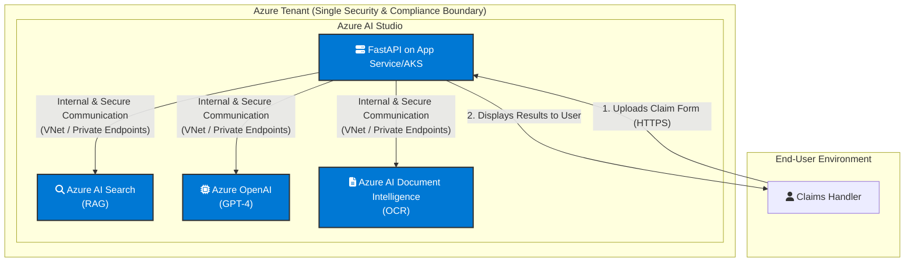

# Risk Assessment: Full Azure AI Stack Migration

This document details the re-evaluation of key business risks assuming the platform is migrated to a fully native Azure AI stack, including Azure OpenAI, Azure AI Search, and Azure AI Studio.

| Risk Category                 | Original Risk Description                                                                                                                       | Net Risk (Post-Azure Migration)   | Rationale & New Measures                                                                                                                                                                                                                                                                                                                                   |
|:------------------------------|:------------------------------------------------------------------------------------------------------------------------------------------------|:----------------------------------|:-----------------------------------------------------------------------------------------------------------------------------------------------------------------------------------------------------------------------------------------------------------------------------------------------------------------------------------------------------------|
| Compliance Privacy Risk       | Processing of sensitive business and personal data can result in data breaches or unintended disclosure.                                        | Low                               | **Rationale:** Migrating to Azure OpenAI & AI Search keeps all data within our compliant Azure tenant. Data is not sent to third parties. **Measures:** Enforce data residency in EU data centers. Use Azure Private Endpoints to prevent data traversing the public internet. Leverage Azure's built-in GDPR and other compliance certifications.         |
| Compliance and Legal Risk     | Careless use or processing of data can lead to violation of regulations (e.g. GDPR).                                                            | Low                               | **Rationale:** Azure provides a single, auditable, and compliant platform, simplifying legal and regulatory adherence. **Measures:** Implement Azure Policy for data handling. Use Azure Purview for data governance and automated data classification. All data processing is covered by Microsoft's enterprise agreements and data protection addendums. |
| Operational Risk (Security)   | Insufficient security can lead to vulnerabilities, attacks, and unauthorized access to business data.                                           | Low                               | **Rationale:** Azure provides a unified security model (Microsoft Defender for Cloud, Entra ID). **Measures:** Centralize identity and access management with Entra ID. Use Azure AI Studio's built-in network security features (VNet integration). Consolidate monitoring and threat detection in Microsoft Sentinel.                                    |
| Reputation Risk               | Incorrect or inappropriate AI output can damage trust from employees, customers, and stakeholders.                                              | Low-Medium                        | **Rationale:** Risk of inappropriate output remains, but Azure provides better control. **Measures:** Implement Azure AI Content Safety to filter harmful or off-topic content. Leverage prompt flow in AI Studio for robust prompt engineering and testing. Fine-tune models on company-specific data within Azure to align outputs with brand voice.     |
| Social/Societal Risk (Bias)   | Unintended bias in the AI output can lead to unequal treatment of employees or customers.                                                       | Medium                            | **Rationale:** The underlying model (e.g., GPT-4) still has biases, but Azure provides tools to manage it. **Measures:** Use the Azure AI Studio Responsible AI dashboard to measure and evaluate model fairness. Log and audit model outputs for bias. Regularly retrain/fine-tune with diverse and representative datasets curated within Azure.         |
| Financial Risk                | Onjuiste AI-suggesties kunnen leiden tot operationele vertragingen, extra kosten en verkeerde besluitvorming.                                   | Low-Medium                        | **Rationale:** The risk of incorrect suggestions remains but is managed within an enterprise ecosystem. **Measures:** Use Azure evaluation metrics to continuously monitor model performance. Costs are consolidated under Azure, potentially higher but more predictable and manageable. Leverage Azure SLAs.                                             |
| Operational Risk (Dependency) | A te grote afhankelijkheid van AI kan leiden tot verminderde menselijke controle, waardoor fouten minder snel worden opgemerkt en gecorrigeerd. | Medium                            | **Rationale:** This risk is inherent to AI adoption and remains. **Measures:** The 'human-in-the-loop' design remains critical. Implement continuous training for claims handlers on the new system's capabilities and limitations. Use Azure's monitoring tools to track model drift and ensure reliability.                                              |

## Future-State Azure Architecture

