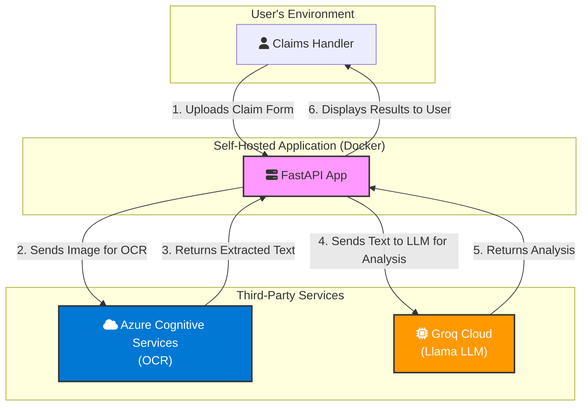

# Risk Assessment Answers: Current Architecture

This document provides the answers to the risk assessment questionnaire based on the current application architecture.

| Section                      | Question / Component                                          | Answer / Score                                                                                                                                     | Comments / Details                                                                                                                                                        |
|:-----------------------------|:--------------------------------------------------------------|:---------------------------------------------------------------------------------------------------------------------------------------------------|:--------------------------------------------------------------------------------------------------------------------------------------------------------------------------|
| 1. Model and Ownership       | Model Owner                                                   | AI Engineering / Development Team                                                                                                                  | The in-house development team is responsible for the AI agent's lifecycle, integration, and maintenance.                                                                  |
|                              | Who will be working with it?                                  | Insurance Claims Handlers / Internal Adjudicators                                                                                                  | The end-users are internal employees who use the agent's output to support their decision-making process.                                                                 |
| 2. Process Replacement       | What manual process is being replaced by this?                | Manual data extraction and review of car insurance claim forms (e.g., European Accident Statement).                                                | The agent automates the reading of structured and unstructured data from submitted documents.                                                                             |
|                              | Why is this process being replaced?                           | To increase efficiency, reduce manual data entry errors, and accelerate the overall claims processing lifecycle.                                   | The primary business drivers are operational efficiency and improved accuracy.                                                                                            |
| 3. Data Quality              | How is data quality ensured?                                  | Input validation is handled at the API level. Data quality is dependent on source image clarity and the performance of the underlying OCR and LLM. | The system relies on Azure Cognitive Services for OCR and the Groq API for language understanding. No additional data governance tools are currently integrated.          |
| 4. External Parties          | Is the model sourced from a third party? (Yes/No)             | Yes                                                                                                                                                | The solution integrates two primary third-party AI services: Microsoft Azure for OCR and Groq for the LLM agent.                                                          |
|                              | Is it a party from the EU? (Yes/No)                           | Partially. Azure has EU data centers. Groq is a US-based company; data residency requires verification against their policies.                     | Data processed by Azure can be confined to EU data centers. However, using the Groq API likely involves data transfer to the US, which has GDPR implications.             |
|                              | What business or customer data can be accessed by this party? | Images of claim forms are sent to Azure for OCR. The extracted text, which may contain PII, is then sent to the Groq LLM API for analysis.         | Sensitive information including names, addresses, policy numbers, and accident details present on the forms are processed by these third-party services.                  |
| 5. Bias & Human Intervention | Risk of discrimination (bias)? (Low/Medium/High)              | Medium                                                                                                                                             | The underlying Llama model from Meta (via Groq) may have inherent biases. Mitigation relies on prompt engineering and the 'human-in-the-loop' design.                     |
|                              | Is there always a human in the loop? (Yes/No)                 | Yes                                                                                                                                                | The system is designed as a co-pilot. An internal claims handler makes all final decisions, using the AI's output as support. This is a critical risk mitigation control. |

## Current Architecture Data Flow

