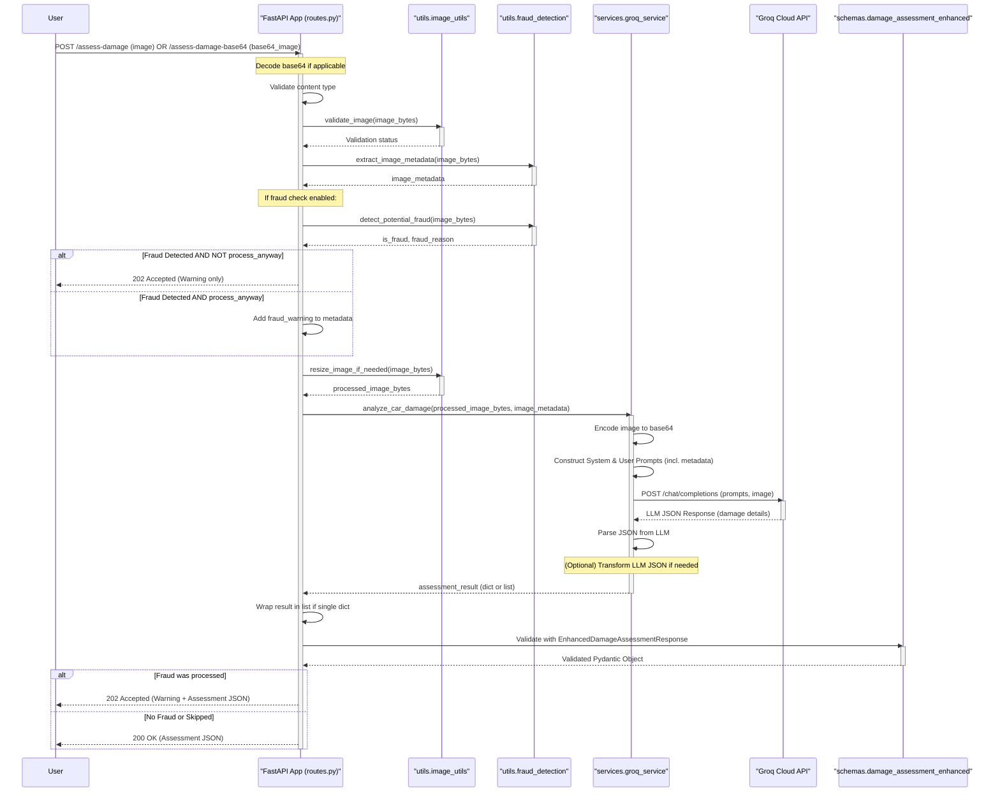

# Architecture and Data Flow

This document outlines the architecture and data flow for the Car Insurance Claims AI Agent, focusing on its two primary functionalities: damage assessment and accident report generation.

## 1. Damage Assessment Endpoints

These endpoints assess car damage from an image and provide make/model, damage details, and repair cost estimations.

*   `/assess-damage` (handles `multipart/form-data` image upload)
*   `/assess-damage-base64` (handles base64 encoded image string)



**Detailed Flow (Damage Assessment):**

1.  **Request Input**: User sends a POST request with an image (either as `UploadFile` or base64 string) to the respective endpoint.
2.  **Route Handling (`routes.py`)**:
    *   The endpoint function in `routes.py` receives the request. If it's base64, it's decoded.
    *   Basic content type validation is performed.
    *   `image_utils.validate_image()`: Ensures the image data is a valid image format.
    *   `fraud_detection.extract_image_metadata()`: Extracts any available metadata from the image.
    *   **Fraud Detection** (if not skipped):
        *   `fraud_detection.detect_potential_fraud()`: Analyzes image for manipulation.
        *   If fraud is detected and `process_anyway` is false, a 202 response with a warning is returned.
        *   If fraud is detected but `process_anyway` is true, the fraud reason is added to the metadata for the LLM and processing continues.
    *   `image_utils.resize_image_if_needed()`: Resizes the image if it exceeds size limits.
    *   The request is then passed to the `GroqService`.
3.  **Groq Service (`groq_service.py`)**:
    *   `analyze_car_damage()`:
        *   Encodes the image to base64 (if not already).
        *   Constructs system and user prompts tailored for damage assessment, including any extracted metadata and fraud indicators.
        *   Sends the image and prompts to the Groq API (`/chat/completions`).
        *   Receives a JSON response from Groq containing the damage assessment details (make, model, damages, estimated costs).
        *   Parses the JSON response.
        *   (Potentially transforms the Groq JSON to align with internal schemas, though this step is less explicit for this endpoint in the current codebase).
4.  **Response Generation (`routes.py`)**:
    *   The route handler receives the assessment result from the `GroqService`.
    *   It ensures the result is a list (as expected by the `EnhancedDamageAssessmentResponse`).
    *   The data is validated against the `EnhancedDamageAssessmentResponse` Pydantic model.
    *   If fraud was detected but processed, a 202 JSON response containing both a warning and the assessment data is sent.
    *   Otherwise, a 200 OK response with the assessment data is sent. FastAPI automatically serializes the Pydantic model to JSON.

## 2. Accident Report Generation Endpoints

These endpoints generate a structured accident report from an image of a European Accident Statement form.

*   `/generate-accident-report` (handles `multipart/form-data` image upload)
*   `/generate-accident-report-base64` (handles base64 encoded image string)

```mermaid
sequenceDiagram
    participant User
    participant FastAPI_App as "FastAPI App (routes.py)"
    participant ImageUtils as "utils.image_utils"
    participant FraudDetection as "utils.fraud_detection"
    participant OCRUtils as "utils.ocr_utils"
    participant AccidentReportService as "services.accident_report_service"
    participant GroqService as "services.groq_service"
    participant GroqAPI as "Groq Cloud API"
    participant PydanticSchemas as "schemas (accident_report_de/en/nl)"

    User->>FastAPI_App: POST /generate-accident-report (image, lang) OR /generate-accident-report-base64 (base64_image, lang)
    activate FastAPI_App
    Note over FastAPI_App: Decode base64 if applicable
    FastAPI_App->>FastAPI_App: Validate content type
    FastAPI_App->>ImageUtils: validate_image(image_bytes)
    activate ImageUtils
    ImageUtils-->>FastAPI_App: Validation status
    deactivate ImageUtils
    FastAPI_App->>FraudDetection: extract_image_metadata(image_bytes)
    activate FraudDetection
    FraudDetection-->>FastAPI_App: image_metadata
    deactivate FraudDetection
    Note over FastAPI_App: If fraud check enabled (similar to damage assessment)
    FastAPI_App->>ImageUtils: resize_image_if_needed(image_bytes)
    activate ImageUtils
    ImageUtils-->>FastAPI_App: processed_image_bytes
    deactivate ImageUtils
    FastAPI_App->>AccidentReportService: generate_accident_report(processed_image_bytes, language, image_metadata)
    activate AccidentReportService
    AccidentReportService->>ImageUtils: preprocess_accident_report_image(image_bytes)
    activate ImageUtils
    ImageUtils-->>AccidentReportService: form_optimized_image
    deactivate ImageUtils
    AccidentReportService->>OCRUtils: preprocess_for_llm_analysis(form_optimized_image)
    activate OCRUtils
    OCRUtils-->>AccidentReportService: ocr_results (extracted_text, form_fields)
    deactivate OCRUtils
    AccidentReportService->>AccidentReportService: Encode image to base64
    AccidentReportService->>AccidentReportService: _get_system_prompt(language)
    AccidentReportService->>AccidentReportService: _get_user_prompt(language)
    AccidentReportService->>AccidentReportService: Enhance user_prompt with ocr_results
    AccidentReportService->>GroqService: (via self.groq_service.client) POST /chat/completions (prompts, image)
    activate GroqService # Represents Groq client interaction
    GroqService->>GroqAPI: POST /chat/completions
    activate GroqAPI
    GroqAPI-->>GroqService: LLM JSON Response String (accident details - new nested format)
    deactivate GroqAPI
    GroqService-->>AccidentReportService: LLM JSON Response String
    deactivate GroqService
    AccidentReportService->>AccidentReportService: json.loads(LLM_response_string)
    AccidentReportService->>AccidentReportService: _transform_LANGUAGE_json(parsed_llm_json)
    Note over AccidentReportService: Transforms LLM JSON to perfectly match Pydantic schema for the language.
    AccidentReportService-->>FastAPI_App: report_pydantic_object (e.g., AccidentReportEN)
    deactivate AccidentReportService
    FastAPI_App->>PydanticSchemas: (Implicitly via FastAPI) Validate and Serialize
    alt Fraud was processed
        FastAPI_App->>FastAPI_App: report.model_dump(by_alias=True)
        FastAPI_App-->>User: 202 Accepted (Warning + Report JSON)
    else No Fraud or Skipped
        FastAPI_App-->>User: 200 OK (Report JSON)
    end
    deactivate FastAPI_App

```

**Detailed Flow (Accident Report Generation):**

1.  **Request Input**: User sends a POST request with an image (either `UploadFile` or base64 string) and a `language` query parameter to the respective endpoint.
2.  **Route Handling (`routes.py`)**:
    *   The endpoint function receives the request. Base64 is decoded if necessary.
    *   Basic content type validation.
    *   `image_utils.validate_image()`: Validates image format.
    *   `fraud_detection.extract_image_metadata()`: Extracts image metadata.
    *   **Fraud Detection**: Handled similarly to the damage assessment flow.
    *   `image_utils.resize_image_if_needed()`: Resizes the image.
    *   The request is then passed to the `AccidentReportService`.
3.  **Accident Report Service (`accident_report_service.py`)**:
    *   `generate_accident_report()`:
        *   `image_utils.preprocess_accident_report_image()`: Applies image enhancements specifically for EAS form recognition.
        *   `ocr_utils.preprocess_for_llm_analysis()`: Performs OCR on the processed image to extract text and identify checked boxes. This OCR data is used to provide additional context to the LLM.
        *   The processed image is encoded to base64.
        *   `_get_system_prompt()` and `_get_user_prompt()`: Retrieve language-specific system and user prompts. The system prompt now contains the new, detailed nested JSON schema that the LLM is expected to follow.
        *   The user prompt is augmented with the extracted OCR context.
        *   A request (including the system prompt, augmented user prompt, and the base64 image) is sent to the Groq API (`/chat/completions`) via `self.groq_service.client.chat.completions.create`. The `response_format` is set to `json_object`.
        *   Receives a JSON string response from Groq.
        *   The JSON string is parsed (`json.loads()`).
        *   The corresponding language-specific transformation function (`_transform_english_json()`, `_transform_dutch_json()`, or `_transform_german_json()`) is called.
            *   These transformation functions now primarily ensure the LLM's output (which is expected to be close to the new schema) is perfectly aligned with the Pydantic models (`AccidentReport`, `AccidentReportEN`, `AccidentReportNL`). They handle creation of nested objects and ensure all required fields are present, defaulting where necessary.
        *   The transformed dictionary is used to instantiate the target Pydantic model (e.g., `AccidentReportEN(**transformed_json)`).
        *   The Pydantic model instance is returned.
4.  **Response Generation (`routes.py`)**:
    *   The route handler receives the Pydantic model instance (e.g., `AccidentReportEN`) from the service.
    *   If fraud was detected but processed, a 202 JSON response containing a warning and the report (serialized using `report.model_dump(by_alias=True)`) is sent.
    *   Otherwise, the Pydantic model instance is returned directly. FastAPI uses the `response_model` (which is a `Union` of the language-specific Pydantic models) to validate and serialize the output to JSON.

This should give you a good overview of the flows. 