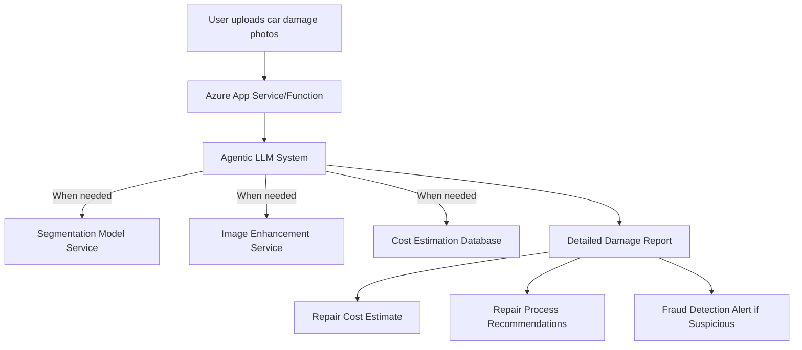
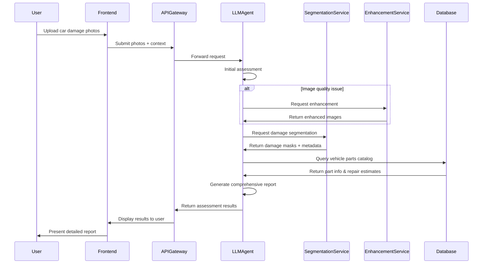

# Car Damage Assessment: Agentic AI Approach

## Business Level Overview

An agentic approach to car damage assessment combines the precision of segmentation models with the reasoning capabilities of large language models. This hybrid system offers significant business advantages:

1. **Higher accuracy**: Leverages multiple AI models for more comprehensive assessment
2. **Better customer experience**: Provides detailed explanations alongside classifications
3. **Reduced fraud**: More effective detection of suspicious claims through multi-model verification
4. **Cost efficiency**: Automates assessment while maintaining quality and accuracy
5. **Adaptability**: Evolves to handle new damage types without complete retraining



## Technical Architecture

### Core Components

1. **LLM Agent**: Orchestrates the entire assessment process
2. **Segmentation Service**: Provides precise damage localization
3. **Image Enhancement**: Improves image quality when needed
4. **Database Services**: Stores vehicle specs, part costs, and historical data
5. **API Gateway**: Manages communication between components
6. **Web/Mobile Frontend**: User interface for submission and results

### Technology Stack

#### Open Source / Free Options

| Component | Technology | License | Purpose |
|-----------|------------|---------|---------|
| LLM Agent Core | Llama-4-Maverick-17B-128E-Instruct | Meta's community license | Core reasoning engine |
| Segmentation Model | MMDetection + SAM (Segment Anything Model) | Apache 2.0 | Precise damage localization |
| Image Enhancement | OpenCV | Apache 2.0 | Image preprocessing |
| API Gateway | FastAPI | MIT | Backend service coordination |
| Vector Database | Chroma | Apache 2.0 | Similarity search for repair cases |
| Frontend | React + TypeScript | MIT | User interface |
| Orchestration | Langchain | MIT | Chain components together |

#### Azure Resources

| Azure Service | Purpose | Pricing Tier |
|---------------|---------|--------------|
| Azure Container Apps | Host the stateless services | Consumption-based |
| Azure Functions | Event-driven processing | Consumption plan |
| Azure Blob Storage | Store images and reports | Standard LRS |
| Azure Cosmos DB | Vehicle and repair database | Serverless |
| Azure Container Registry | Store Docker images | Basic |
| Azure App Service | Host the web frontend | Standard S1 |
| Azure AI Services | Backup/fallback for vision services | Pay-as-you-go |
| Azure Monitor | System monitoring | Basic |

## Detailed Flow Architecture



## Implementation Details

### 1. LLM Agent Service

The LLM agent serves as the coordinator of the entire process, deciding when to call other services.

```python
# Core agent implementation using LangChain and Llama 4 Maverick
from langchain.agents import Tool, AgentExecutor, create_react_agent
from langchain.prompts import PromptTemplate
from langchain_community.llms import HuggingFacePipeline
from transformers import AutoTokenizer, Llama4ForConditionalGeneration
import torch

# Set up Llama 4 Maverick model
model_id = "meta-llama/Llama-4-Maverick-17B-128E-Instruct"
tokenizer = AutoTokenizer.from_pretrained(model_id)
model = Llama4ForConditionalGeneration.from_pretrained(
    model_id, device_map="auto", torch_dtype=torch.bfloat16
)

# Define the tools our agent can use
tools = [
    Tool(
        name="segment_damage",
        func=lambda x: call_segmentation_service(x),
        description="Segment and identify damaged areas in a car image"
    ),
    Tool(
        name="enhance_image",
        func=lambda x: call_enhancement_service(x),
        description="Enhance image quality for better analysis"
    ),
    Tool(
        name="lookup_vehicle_parts",
        func=lambda x: query_vehicle_database(x),
        description="Look up information about vehicle parts and repair costs"
    )
]

# Create the agent with the tools
llm_pipeline = pipeline(
    "text-generation",
    model=model,
    tokenizer=tokenizer,
    max_length=4096
)
llm = HuggingFacePipeline(pipeline=llm_pipeline)

prompt = PromptTemplate.from_template(
    """You are a car damage assessment expert. Analyze the images and determine:
    1. What type of damage is present
    2. Which parts are affected
    3. Severity of the damage
    4. Estimated repair cost
    5. If the damage appears suspicious

    Use your tools when needed to get more precise information.
    {format_instructions}
    
    Question: {input}
    {agent_scratchpad}
    """
)

agent = create_react_agent(llm, tools, prompt)
agent_executor = AgentExecutor(agent=agent, tools=tools, verbose=True)
```

### 2. Segmentation Service

```python
# Using MMDetection and SAM for precise damage segmentation
import torch
from mmdet.apis import init_detector, inference_detector
from segment_anything import sam_model_registry, SamPredictor

class DamageSegmentationService:
    def __init__(self):
        # Initialize MMDetection model for damage detection
        self.damage_detector = init_detector(
            "configs/car_damage_config.py", 
            "checkpoints/car_damage_model.pth", 
            device="cuda:0"
        )
        
        # Initialize SAM for precise segmentation
        self.sam = sam_model_registry["vit_h"](checkpoint="sam_vit_h_4b8939.pth")
        self.sam_predictor = SamPredictor(self.sam)
    
    def process_image(self, image_path):
        # Run damage detection
        damage_results = inference_detector(self.damage_detector, image_path)
        
        # For detected damage areas, run SAM for precise masks
        image = cv2.imread(image_path)
        self.sam_predictor.set_image(image)
        
        damage_masks = []
        for bbox in damage_results[0]:
            if bbox[4] > 0.5:  # Confidence threshold
                # Generate SAM mask from bounding box
                box = bbox[:4]
                masks, _, _ = self.sam_predictor.predict(
                    box=box,
                    multimask_output=False
                )
                damage_masks.append({
                    "bbox": box.tolist(),
                    "mask": masks[0].tolist(),
                    "confidence": float(bbox[4]),
                    "damage_type": self.classify_damage_type(image, masks[0])
                })
        
        return damage_masks
    
    def classify_damage_type(self, image, mask):
        # Classify the type of damage based on the masked region
        # Implementation details...
        pass
```

### 3. Azure Deployment Infrastructure

```yaml
# Azure Bicep template for infrastructure deployment
param location string = resourceGroup().location
param appName string = 'cardamageai'

// Container Registry
resource acr 'Microsoft.ContainerRegistry/registries@2021-06-01-preview' = {
  name: '${appName}acr'
  location: location
  sku: {
    name: 'Basic'
  }
  properties: {
    adminUserEnabled: true
  }
}

// Container Apps Environment
resource environment 'Microsoft.App/managedEnvironments@2022-03-01' = {
  name: '${appName}env'
  location: location
  properties: {}
}

// LLM Agent Container App
resource llmAgentApp 'Microsoft.App/containerApps@2022-03-01' = {
  name: '${appName}-llm-agent'
  location: location
  properties: {
    managedEnvironmentId: environment.id
    configuration: {
      ingress: {
        external: true
        targetPort: 8000
      }
      registries: [
        {
          server: acr.properties.loginServer
          username: acr.listCredentials().username
          passwordSecretRef: 'acr-password'
        }
      ]
      secrets: [
        {
          name: 'acr-password'
          value: acr.listCredentials().passwords[0].value
        }
      ]
    }
    template: {
      containers: [
        {
          name: 'llm-agent'
          image: '${acr.properties.loginServer}/llm-agent:latest'
          resources: {
            cpu: 2
            memory: '8Gi'
          }
          env: [
            {
              name: 'SEGMENTATION_SERVICE_URL'
              value: 'https://${segmentationApp.properties.configuration.ingress.fqdn}'
            }
          ]
        }
      ]
      scale: {
        minReplicas: 1
        maxReplicas: 5
      }
    }
  }
}

// Segmentation Service Container App
resource segmentationApp 'Microsoft.App/containerApps@2022-03-01' = {
  name: '${appName}-segmentation'
  location: location
  properties: {
    managedEnvironmentId: environment.id
    // Additional configuration...
  }
}

// Storage Account for images
resource storageAccount 'Microsoft.Storage/storageAccounts@2021-08-01' = {
  name: '${appName}storage'
  location: location
  kind: 'StorageV2'
  sku: {
    name: 'Standard_LRS'
  }
  properties: {
    supportsHttpsTrafficOnly: true
  }
}

// Cosmos DB for vehicle and repair database
resource cosmosDb 'Microsoft.DocumentDB/databaseAccounts@2021-10-15' = {
  name: '${appName}-cosmos'
  location: location
  properties: {
    databaseAccountOfferType: 'Standard'
    // Additional configuration...
  }
}
```

## Frontend Implementation

The frontend is built with React and TypeScript, providing an intuitive interface for users to upload images and view assessment results.

```typescript
// Sample React component for image upload and analysis
import React, { useState } from 'react';
import axios from 'axios';

interface DamageReport {
  damageTypes: string[];
  affectedParts: string[];
  severityScore: number;
  estimatedCost: {
    min: number;
    max: number;
    currency: string;
  };
  repairRecommendations: string[];
  suspiciousFlags: string[];
}

const CarDamageAnalysis: React.FC = () => {
  const [images, setImages] = useState<File[]>([]);
  const [loading, setLoading] = useState<boolean>(false);
  const [report, setReport] = useState<DamageReport | null>(null);

  const handleImageUpload = (e: React.ChangeEvent<HTMLInputElement>) => {
    if (e.target.files) {
      setImages(Array.from(e.target.files));
    }
  };

  const submitImages = async () => {
    if (images.length === 0) return;

    setLoading(true);
    const formData = new FormData();
    images.forEach(image => {
      formData.append('images', image);
    });

    try {
      const response = await axios.post('/api/analyze-damage', formData);
      setReport(response.data);
    } catch (error) {
      console.error('Error analyzing damage:', error);
    } finally {
      setLoading(false);
    }
  };

  return (
    <div className="car-damage-analysis">
      <h1>Car Damage Assessment</h1>
      
      <div className="upload-section">
        <input
          type="file"
          accept="image/*"
          multiple
          onChange={handleImageUpload}
        />
        <button 
          onClick={submitImages}
          disabled={images.length === 0 || loading}
        >
          {loading ? 'Analyzing...' : 'Analyze Damage'}
        </button>
      </div>

      {report && (
        <div className="damage-report">
          <h2>Damage Assessment Results</h2>
          {/* Display report details */}
        </div>
      )}
    </div>
  );
};

export default CarDamageAnalysis;
```

## Cost Analysis

| Service | Estimated Monthly Cost (USD) |
|---------|------------------------------|
| Azure Container Apps | $150 - $300 |
| Azure Functions | $20 - $50 |
| Azure Blob Storage | $25 - $75 |
| Azure Cosmos DB | $100 - $250 |
| Azure Container Registry | $5 |
| Azure App Service | $70 - $140 |
| Azure Monitor | $0 - $30 |
| Total | $370 - $850 |

Costs can be optimized through:
- Using consumption-based pricing
- Scaling down during off-peak hours
- Reserved instances for predictable workloads
- Optimizing storage tiers

## Advantages of the Agentic Approach

1. **Flexible architecture**: Components can be upgraded independently
2. **Targeted precision**: Uses specialized tools only when needed
3. **Explainability**: Provides reasoning behind assessments
4. **Extensibility**: New tools can be added without redesigning the system
5. **Cost efficiency**: Resources are only used when necessary

## Implementation Timeline

1. **Phase 1 (Month 1-2)**: Core infrastructure setup, base models deployment
2. **Phase 2 (Month 3-4)**: Integration of segmentation and LLM agent
3. **Phase 3 (Month 5)**: Frontend development and API refinement
4. **Phase 4 (Month 6)**: Testing, optimization, and deployment

## Security Considerations

- Implement Azure Key Vault for secrets management
- Use managed identities for service-to-service authentication
- Enable Azure DDoS Protection
- Implement rate limiting and input validation
- Set up Azure Security Center for continuous monitoring

## References

1. [Meta's Llama 4 Maverick](https://github.com/meta-llama/llama-models)
2. [Llama 4 Maverick on GitHub Models](https://github.blog/changelog/2025-04-14-the-llama-4-herd-is-now-generally-available-in-github-models/)
3. [Llama 4 Maverick on Azure ML](https://github.com/marketplace/models/azureml-meta/Llama-4-Maverick-17B-128E-Instruct-FP8)
4. [MMDetection Framework](https://github.com/open-mmlab/mmdetection)
5. [Segment Anything Model (SAM)](https://segment-anything.com/)
6. [Azure Container Apps](https://azure.microsoft.com/en-us/services/container-apps/)
7. [LangChain Framework](https://www.langchain.com/)
8. [Labellerr's guide on car damage detection models](https://www.labellerr.com/blog/ml-beginners-guide-to-build-car-damage-detection-ai-model/) 