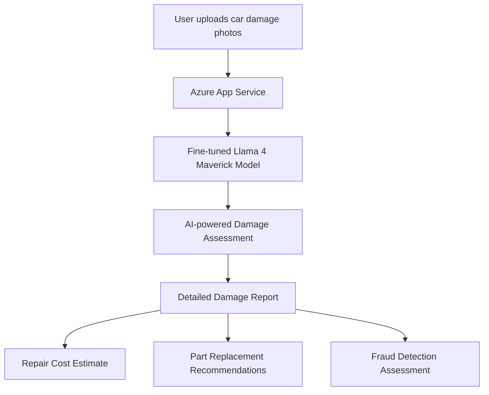
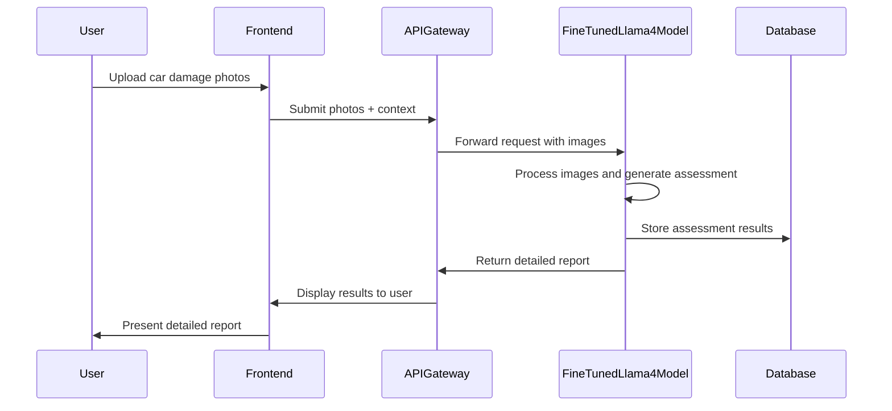

# Fine-tuning Llama 4 Maverick for Car Damage Assessment

## Business Level Overview

An alternative approach to the agentic system is to fine-tune Llama 4 Maverick directly for car damage assessment tasks. This approach offers several distinct advantages:

1. **Simplified architecture**: Single model rather than multiple coordinated services
2. **Reduced latency**: No need for multiple API calls between services
3. **Unified reasoning**: Model learns to combine visual analysis and reasoning in one step
4. **Cost-efficient deployment**: Fewer resources needed to maintain and scale
5. **Streamlined updates**: Fine-tune on new data without rebuilding entire system



## Technical Approach

The fine-tuning approach leverages Llama 4 Maverick's multimodal capabilities by training it directly on car damage images paired with expert assessments. This customized model can then process new damage photos and generate comprehensive reports without intermediate tools.

### Dataset Requirements

For effective fine-tuning, a specialized dataset is required:

| Dataset Component | Description | Source |
|-------------------|-------------|--------|
| Car damage images | High-quality photos of damaged vehicles | Insurance claims, public datasets |
| Damage annotations | Precise damage locations and types | Expert-labeled data, COCO format |
| Assessment reports | Detailed descriptions of damage and repair needs | Insurance adjuster reports |
| Cost estimates | Repair cost ranges for various damage types | Historical claim data |

## Fine-tuning Pipeline

### 1. Dataset Preparation

```python
# Dataset preparation in COCO format with custom fields for assessment reports
import json
from pathlib import Path

def prepare_fine_tuning_dataset(image_dir, annotation_file, output_path):
    """Prepare a dataset for fine-tuning Llama 4 Maverick for car damage assessment"""
    
    # Load existing COCO-format annotations
    with open(annotation_file, 'r') as f:
        annotations = json.load(f)
    
    # Create fine-tuning dataset in conversation format
    fine_tuning_data = []
    
    for image_info in annotations['images']:
        image_id = image_info['id']
        image_path = Path(image_dir) / image_info['file_name']
        
        # Find all annotations for this image
        image_annotations = [a for a in annotations['annotations'] if a['image_id'] == image_id]
        
        if not image_annotations:
            continue
        
        # Get damage categories
        damage_types = []
        for ann in image_annotations:
            category_id = ann['category_id']
            category = next((c for c in annotations['categories'] if c['id'] == category_id), None)
            if category:
                damage_types.append(category['name'])
        
        # Create conversation sample
        conversation = {
            "messages": [
                {
                    "role": "user",
                    "content": [
                        {"type": "image_url", "image_url": {"url": str(image_path)}},
                        {"type": "text", "text": "Analyze this car damage image and provide a detailed assessment including damage type, affected parts, severity, and estimated repair costs."}
                    ]
                },
                {
                    "role": "assistant",
                    "content": generate_detailed_response(image_annotations, damage_types)
                }
            ]
        }
        
        fine_tuning_data.append(conversation)
    
    # Save fine-tuning dataset
    with open(output_path, 'w') as f:
        json.dump(fine_tuning_data, f, indent=2)
    
    return len(fine_tuning_data)

def generate_detailed_response(annotations, damage_types):
    """Generate detailed assistant response based on annotations"""
    # Custom logic to generate expert-like assessment from annotations
    # This would be informed by actual expert assessments in real implementation
    
    affected_parts = []
    total_damage_area = 0
    
    for ann in annotations:
        part = determine_car_part(ann['bbox'])
        affected_parts.append(part)
        total_damage_area += ann['area']
    
    severity = determine_severity(total_damage_area, len(annotations))
    cost_estimate = estimate_repair_cost(damage_types, affected_parts, severity)
    
    response = f"""Based on my analysis, I can identify the following damage:

1. Damage Types: {', '.join(damage_types)}
2. Affected Parts: {', '.join(set(affected_parts))}
3. Severity: {severity}
4. Estimated Repair Costs: ${cost_estimate['min']} - ${cost_estimate['max']}

The damage appears to be concentrated on the {affected_parts[0]} area, with visible {damage_types[0]}. 
This type of damage typically requires {get_repair_recommendation(damage_types, affected_parts)}.

{get_additional_notes(damage_types, severity)}"""

    return response
```

### 2. Fine-tuning Configuration

```python
# Fine-tuning configuration using Azure ML
from azure.ai.ml import MLClient
from azure.ai.ml.entities import CustomModel, Environment, CodeConfiguration
from azure.ai.ml.constants import AssetTypes
from azure.identity import DefaultAzureCredential

def configure_fine_tuning(
    subscription_id,
    resource_group,
    workspace_name,
    model_name="car-damage-llama4-maverick",
    dataset_path="data/car_damage_training.json",
    base_model="meta-llama/Llama-4-Maverick-17B-128E-Instruct",
):
    """Configure fine-tuning job for Llama 4 Maverick on Azure ML"""
    
    # Initialize Azure ML client
    credential = DefaultAzureCredential()
    ml_client = MLClient(
        credential=credential,
        subscription_id=subscription_id,
        resource_group_name=resource_group,
        workspace_name=workspace_name,
    )
    
    # Create or get compute cluster
    compute_name = "gpu-cluster"
    
    try:
        compute_cluster = ml_client.compute.get(compute_name)
        print(f"Using existing compute cluster: {compute_name}")
    except Exception:
        print(f"Creating new compute cluster: {compute_name}")
        compute_cluster = AmlCompute(
            name=compute_name,
            type="amlcompute",
            size="Standard_NC24rs_v3",  # A100 GPU
            min_instances=0,
            max_instances=4,
            idle_time_before_scale_down=120,
        )
        ml_client.compute.begin_create_or_update(compute_cluster).result()
    
    # Create fine-tuning job
    job = Command(
        code="./code",  # Local path to fine-tuning script
        command="python fine_tune.py --base_model ${{inputs.base_model}} --training_data ${{inputs.training_data}} --output_dir ${{outputs.model_dir}}",
        environment="azureml:llama-4-training-env:1",
        compute=compute_name,
        inputs={
            "base_model": Input(type=AssetTypes.URI_FOLDER, path=base_model),
            "training_data": Input(type=AssetTypes.URI_FILE, path=dataset_path)
        },
        outputs={
            "model_dir": Output(type=AssetTypes.URI_FOLDER)
        },
        display_name=f"fine-tune-{model_name}",
    )
    
    # Submit job
    returned_job = ml_client.jobs.create_or_update(job)
    print(f"Submitted job: {returned_job.name}")
    
    return returned_job
```

### 3. Fine-tuning Script

```python
# fine_tune.py
import os
import argparse
from transformers import (
    Llama4ForConditionalGeneration,
    AutoTokenizer,
    TrainingArguments,
    Trainer,
    DataCollatorForSeq2Seq,
)
from datasets import load_dataset
import torch

def main():
    parser = argparse.ArgumentParser()
    parser.add_argument("--base_model", type=str, required=True)
    parser.add_argument("--training_data", type=str, required=True)
    parser.add_argument("--output_dir", type=str, required=True)
    parser.add_argument("--epochs", type=int, default=3)
    parser.add_argument("--batch_size", type=int, default=4)
    parser.add_argument("--learning_rate", type=float, default=5e-5)
    args = parser.parse_args()
    
    # Load model and tokenizer
    model = Llama4ForConditionalGeneration.from_pretrained(
        args.base_model,
        torch_dtype=torch.bfloat16,
        device_map="auto",
    )
    tokenizer = AutoTokenizer.from_pretrained(args.base_model)
    
    # Load and process dataset
    dataset = load_dataset("json", data_files=args.training_data)
    
    # Prepare dataset
    def process_dataset(examples):
        # Process each conversation into input_ids and labels
        conversations = []
        for msg in examples["messages"]:
            # Format according to Llama chat template
            conversations.append(tokenizer.apply_chat_template(msg))
        
        # Tokenize
        model_inputs = tokenizer(
            conversations,
            max_length=2048,
            padding="max_length",
            truncation=True,
            return_tensors="pt"
        )
        
        return model_inputs
    
    processed_dataset = dataset.map(process_dataset, batched=True)
    
    # Setup trainer
    training_args = TrainingArguments(
        output_dir=args.output_dir,
        num_train_epochs=args.epochs,
        per_device_train_batch_size=args.batch_size,
        gradient_accumulation_steps=4,
        learning_rate=args.learning_rate,
        weight_decay=0.01,
        save_strategy="epoch",
        save_total_limit=2,
        fp16=True,
        report_to="tensorboard",
        logging_steps=10,
    )
    
    trainer = Trainer(
        model=model,
        args=training_args,
        train_dataset=processed_dataset["train"],
        data_collator=DataCollatorForSeq2Seq(tokenizer=tokenizer, padding=True),
    )
    
    # Train
    trainer.train()
    
    # Save model and tokenizer
    model.save_pretrained(args.output_dir)
    tokenizer.save_pretrained(args.output_dir)

if __name__ == "__main__":
    main()
```

## Deployment Architecture

The fine-tuned model can be deployed directly to Azure Container Apps or Azure Machine Learning, providing a streamlined architecture for car damage assessment.



### Azure Container App Deployment

```yaml
# Azure Bicep template for fine-tuned model deployment
param location string = resourceGroup().location
param appName string = 'cardamage-finetuned'

// Container Registry
resource acr 'Microsoft.ContainerRegistry/registries@2021-06-01-preview' = {
  name: '${appName}acr'
  location: location
  sku: {
    name: 'Basic'
  }
  properties: {
    adminUserEnabled: true
  }
}

// Container Apps Environment
resource environment 'Microsoft.App/managedEnvironments@2022-03-01' = {
  name: '${appName}env'
  location: location
  properties: {}
}

// Fine-tuned Model Container App
resource modelApp 'Microsoft.App/containerApps@2022-03-01' = {
  name: '${appName}-model'
  location: location
  properties: {
    managedEnvironmentId: environment.id
    configuration: {
      ingress: {
        external: true
        targetPort: 8000
      }
      registries: [
        {
          server: acr.properties.loginServer
          username: acr.listCredentials().username
          passwordSecretRef: 'acr-password'
        }
      ]
      secrets: [
        {
          name: 'acr-password'
          value: acr.listCredentials().passwords[0].value
        }
      ]
    }
    template: {
      containers: [
        {
          name: 'car-damage-model'
          image: '${acr.properties.loginServer}/car-damage-model:latest'
          resources: {
            cpu: 4
            memory: '16Gi'
          }
        }
      ]
      scale: {
        minReplicas: 1
        maxReplicas: 3
      }
    }
  }
}

// Storage Account for images and reports
resource storageAccount 'Microsoft.Storage/storageAccounts@2021-08-01' = {
  name: '${appName}storage'
  location: location
  kind: 'StorageV2'
  sku: {
    name: 'Standard_LRS'
  }
  properties: {
    supportsHttpsTrafficOnly: true
  }
}
```

## API Implementation

Update the existing FastAPI implementation to use the fine-tuned model directly:

```python
# api/routes/damage_assessment.py
from fastapi import APIRouter, UploadFile, File, HTTPException, BackgroundTasks
from fastapi.responses import JSONResponse
import base64
import os
import io
from PIL import Image
import torch
from transformers import AutoTokenizer, Llama4ForConditionalGeneration
from src.core.config import settings
from src.logger import get_logger

router = APIRouter()
logger = get_logger(__name__)

# Load fine-tuned model and tokenizer
model_id = "models/car-damage-finetuned"
tokenizer = AutoTokenizer.from_pretrained(model_id)
model = Llama4ForConditionalGeneration.from_pretrained(
    model_id, 
    device_map="auto", 
    torch_dtype=torch.bfloat16
)

@router.post("/assess-damage")
async def assess_damage(image: UploadFile = File(...)):
    """Assess damage from uploaded image using fine-tuned Llama 4 Maverick"""
    try:
        # Read and prepare image
        contents = await image.read()
        img = Image.open(io.BytesIO(contents))
        
        # Convert to format compatible with model
        img_base64 = encode_image_to_base64(img)
        
        # Create chat messages with image
        messages = [
            {
                "role": "user",
                "content": [
                    {"type": "image_url", "image_url": {"url": f"data:image/jpeg;base64,{img_base64}"}},
                    {"type": "text", "text": "Analyze this car image and provide a detailed damage assessment, including damage type, severity, affected parts, and estimated repair costs."}
                ]
            }
        ]
        
        # Generate model input
        inputs = tokenizer.apply_chat_template(
            messages, add_generation_prompt=True, return_tensors="pt"
        ).to(model.device)
        
        # Generate response
        outputs = model.generate(
            inputs,
            max_new_tokens=1024,
            temperature=0.7,
            top_p=0.9,
        )
        
        # Decode response
        response = tokenizer.batch_decode(outputs[:,inputs.shape[1]:])[0]
        
        # Parse response into structured format
        assessment = parse_assessment_response(response)
        
        return JSONResponse(content=assessment)
    
    except Exception as e:
        logger.error(f"Error processing image: {str(e)}")
        raise HTTPException(status_code=500, detail=f"Assessment failed: {str(e)}")

def encode_image_to_base64(image):
    """Convert PIL Image to base64 string"""
    buffered = io.BytesIO()
    image.save(buffered, format="JPEG")
    return base64.b64encode(buffered.getvalue()).decode("utf-8")

def parse_assessment_response(response):
    """Parse the model's text response into structured data"""
    # Implement parsing logic to extract:
    # - Damage types
    # - Affected parts
    # - Severity
    # - Cost estimates
    # This can be done with regex or more sophisticated parsing
    
    # Simplified example:
    assessment = {
        "damage_types": [],
        "affected_parts": [],
        "severity": "",
        "cost_estimate": {"min": 0, "max": 0, "currency": "USD"},
        "repair_recommendations": [],
        "full_assessment": response
    }
    
    # Populate fields by parsing response
    # ...
    
    return assessment
```

## Comparison with Agentic Approach

| Aspect | Fine-tuning Approach | Agentic Approach |
|--------|----------------------|------------------|
| Architecture Complexity | Lower | Higher |
| Development Time | Shorter | Longer |
| Inference Latency | Lower | Higher |
| Precision | Less precise on specific details | More precise with specialized tools |
| Explainability | Limited to model's explanation | More transparent through tool usage |
| Scalability | Simpler to scale | More components to scale |
| Maintenance | Primarily model updates | Multiple components to maintain |
| Cost | Lower serving cost | Higher due to multiple services |
| Data Requirements | Needs high-quality paired data | Can work with less domain-specific data |

## Cost Analysis

| Service | Estimated Monthly Cost (USD) |
|---------|------------------------------|
| Azure Container Apps (Model Serving) | $300 - $600 |
| Azure Blob Storage | $25 - $75 |
| Azure Cosmos DB | $100 - $250 |
| Azure Container Registry | $5 |
| Azure Monitor | $0 - $30 |
| Total | $430 - $960 |

## Implementation Timeline

1. **Phase 1 (Month 1)**: Dataset collection and preparation
2. **Phase 2 (Month 2)**: Fine-tuning Llama 4 Maverick
3. **Phase 3 (Month 3)**: API development and testing
4. **Phase 4 (Month 4)**: Deployment and optimization

## Conclusion

Fine-tuning Llama 4 Maverick provides a streamlined approach to car damage assessment with several advantages:

1. **Simplified architecture**: Single model deployment vs multiple services
2. **Lower latency**: Direct assessment without tool-calling overhead
3. **Easier deployment**: Single Docker container with the fine-tuned model
4. **Cost efficiency**: Reduced infrastructure requirements

This approach is particularly suitable when:
- You have access to high-quality training data with expert assessments
- Latency and deployment simplicity are critical factors
- The task requirements are stable and well-defined

The trade-off is less flexibility compared to the agentic approach, but with potentially better performance on the specific task of car damage assessment due to specialized fine-tuning.

## References

1. [Meta's Llama 4 Maverick](https://github.com/meta-llama/llama-models)
2. [Llama 4 Maverick on GitHub Models](https://github.blog/changelog/2025-04-14-the-llama-4-herd-is-now-generally-available-in-github-models/)
3. [Azure ML Fine-tuning](https://learn.microsoft.com/en-us/azure/machine-learning/concept-fine-tune-foundation-models)
4. [MMDetection Dataset Customization](https://mmdetection.readthedocs.io/en/dev-3.x/advanced_guides/customize_dataset.html)
5. [Labellerr's guide on car damage detection models](https://www.labellerr.com/blog/ml-beginners-guide-to-build-car-damage-detection-ai-model/)