# **Approach 1: Azure-Native Single-Agent + RAG**

*In this approach, the entire Claims AI workflow runs as a single Azure-based agent, enhanced with Retrieval-Augmented Generation (RAG) for grounded answers. All components – vision, OCR, search, LLM, safety – leverage Azure services.* **Yes, this can be done fully on Azure** using services like **Azure Computer Vision**, **Form Recognizer**, **Azure Cognitive Search** (for RAG), **Azure OpenAI (GPT-4)**, and **Azure Content Safety**, all orchestrated by a single **Azure AI Foundry** agent. We describe the architecture in detail below.

## **Context Diagram (C4 Level 1)**

The context diagram shows how external actors interact with the Azure-hosted Claims AI Assistant. An end-user (e.g. a customer or claims agent) submits claim data (images of vehicle damage, accident form) to the AI assistant, and receives an assessment report. A human claims expert is an external party who may be involved for manual review if the AI flags a case for escalation. All AI processing occurs within Azure's environment.

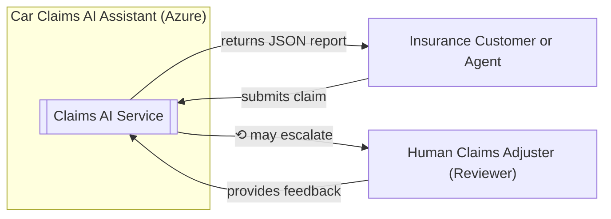

**Context Description:** The *Claims AI Assistant* is hosted in Azure (within a secure EU region, e.g. **West Europe**). The **User** interacts via a REST API (e.g. an HTTP POST with images and forms) exposed by the service. In normal operation, the assistant processes the request entirely with AI. In exceptional cases (complex or flagged content), the system involves a **Human Claims Adjuster** for review. All data and computation remain in Azure for compliance.

* **User (External):** Person (customer or insurance agent) who provides input (photos of damage, accident report form) and receives the assessment result.
* **Claims AI Service (System):** The Azure-hosted AI solution that processes claims and produces JSON results. This encompasses the agent logic and all Azure services used.
* **Human Claims Adjuster (External):** Insurance expert who can review or approve results if the AI defers (e.g. due to low confidence or safety issues).

## **Container Diagram (C4 Level 2)**

The container diagram breaks down the Azure components inside the Claims AI Service. In Approach 1, there is one primary *Agent container* orchestrating calls to various Azure cognitive services. An API gateway exposes the endpoint, and supporting services (like monitoring and secrets management) are included. All containers are within Azure's environment (here deployed in an EU region).

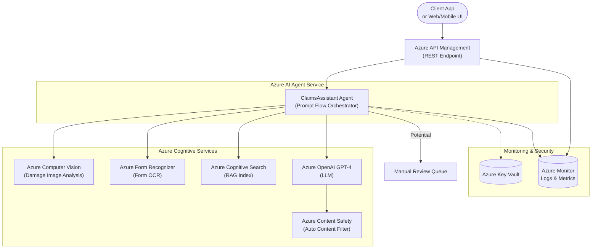

**Container Description:** All major functions are delivered via Azure-managed services:

* **Azure API Management (APIM):** Front-end API gateway that clients call (`POST /assess-damage`). It handles authentication, throttling, and routing to the backend agent. APIM is internet-facing and passes requests into the secure Azure environment.
* **ClaimsAssistant Agent (Azure AI Foundry Prompt Flow):** The core **orchestrator** implemented as an Azure AI **Agent** (e.g. using Azure AI Foundry's managed agent service). It encapsulates the claim processing logic as a single "brain." The agent receives inputs from APIM, invokes the needed Azure Cognitive Services in sequence, and collates the final response. This agent is analogous to the original FastAPI app + Groq logic but now runs in Azure's managed environment (Prompt Flow), with tools for vision, OCR, search, and LLM calls.
* **Azure Computer Vision Service:** An Azure AI service that analyzes the car damage image. It provides tags or descriptions of visible damage (dents, scratches, broken parts). This replaces the Groq vision model with an Azure-native vision model. (We could use the pre-built **Image Analysis** API or a **Custom Vision** model fine-tuned for vehicle damage.)
* **Azure Form Recognizer (Document Intelligence):** Extracts structured data from the European Accident Statement form. It reads the form image (checklist, text fields) and returns a JSON of the filled fields (e.g. accident date, involved parties, checked boxes). This automates OCR for the accident form.
* **Azure Cognitive Search (with RAG Index):** A search service with a **vector index** of relevant documents (e.g. car parts prices, repair manuals specific to car model/brand). The agent uses Cognitive Search to ground the LLM: it sends a query (constructed from the vision/OCR results) and retrieves the top relevant passages. This **Retrieval-Augmented Generation** step supplies factual context to the LLM, reducing hallucinations.
* **Azure OpenAI (GPT-4) Service:** The large language model (GPT-4, deployed in Azure) that composes the final answer. The agent prompts GPT-4 with: (a) user inputs, (b) extracted form data, (c) damage findings, and (d) retrieved docs. GPT-4 then generates a structured **JSON** assessment (e.g. list of damages, recommended repairs, costs). The Azure OpenAI service is used here to ensure data stays in Azure (with compliance to EU region deployment).
* **Azure Content Safety:** An integrated content filtering service ensuring the prompt and response are free of disallowed content. In Azure, **content moderation is automatically applied** to OpenAI inputs/outputs by Content Safety models. This catches profanity, sensitive data, or policy violations. If the model output is flagged (or if the agent's confidence is low), the agent can route the case for human review.
* **Human Review Queue:** (Optional) Represents a mechanism for manual oversight. For instance, the agent could send the query and draft output to a secure queue or an Azure Logic App that notifies a human adjuster. The human can then verify or correct the assessment. This ensures high-risk or unclear cases are handled appropriately. (In a fully automated flow, this might rarely be used, but it's available for compliance.)
* **Azure Key Vault:** Securely stores secrets/keys (e.g. Cognitive Services API keys, OpenAI keys). The agent retrieves credentials from Key Vault at runtime, so no secrets are hard-coded.
* **Monitoring (Azure Monitor/Log Analytics):** All components emit telemetry. APIM logs request metrics and passes diagnostics to **Azure Monitor** or **Sentinel**. The agent and cognitive services calls are logged (latencies, errors) for end-to-end observability. This allows auditing of the AI decisions – an advantage of using Azure (audit trails are captured natively).

All these containers reside in Azure's cloud, with network security configured (APIM to agent via VNet integration, private endpoints for Cognitive Services when possible). This single-agent architecture on Azure preserves all functionality of the original system, while adding Azure benefits like managed security, scaling, and integrated content filtering.

## **Component Diagram (C4 Level 3)**

The component diagram zooms into the **ClaimsAssistant Agent**, detailing its internal workflow. Within the agent, we illustrate logical modules corresponding to each step of the claim analysis. These components execute sequentially (as programmed in the Prompt Flow or agent code):

```mermaid
flowchart TD
    subgraph ClaimsAssistant_Agent
        direction TB
        A_In[Input Handler] --> B_Vision[Vision Analyzer<br/>(Image Tagging)]
        B_Vision --> C_OCR[Form OCR Processor]
        C_OCR --> D_Grounding[Knowledge Retrieval Module]
        D_Grounding --> E_LLM[LLM Prompt Builder & Invoker]
        E_LLM --> F_ResultParser[Response Parser & Validator]
        F_ResultParser --> G_Escalation[Confidence & Safety Checker]
    end
    subgraph Azure_Services_Internal
        VisionAPI[[Computer Vision API]]
        OCRAPI[[Form Recognizer API]]
        SearchAPI[[Cognitive Search Index]]
        GPT[[GPT-4 Model]]
        SafetyAPI[[Content Safety Filter]]
    end
    %% Interactions between agent components and Azure services:
    B_Vision -->|calls| VisionAPI
    C_OCR -->|calls| OCRAPI
    D_Grounding -->|queries| SearchAPI
    E_LLM -->|calls| GPT
    E_LLM -.-> SafetyAPI
    G_Escalation -.-> HumanExpert[(Human Reviewer)]
```

**Component Description:** Inside the **Agent**, the claim processing logic is broken into stages:

* **Input Handler:** Validates and pre-processes the incoming request. It checks the image files (e.g. ensuring the photos are clear, acceptable format) and extracts the embedded form image. It might invoke basic utilities (similar to the original `image_utils.py` for resizing or `fraud_detection.py` for image metadata to detect tampering). Once inputs are ready, it triggers the next steps.
* **Vision Analyzer (Image Tagging):** This module takes the car damage images and calls **Azure Computer Vision**. It might use a custom model or the generic image analysis API to get descriptions of the damage. For example, it might identify "front bumper dented" or "broken left headlight." These tags or captions are fed into later steps. (In code, this could be a Prompt Flow tool that calls the Vision API and returns structured tags.)
* **Form OCR Processor:** This component sends the accident report form image to **Azure Form Recognizer**. It uses a trained model (or the prebuilt form model if format is standard) to extract fields like the checked injury boxes, date/time of accident, sketch details, etc. The result is a JSON of structured data (or text) describing the accident circumstances. This structured data is important for context (e.g. knowing which car parts were impacted per the form).
* **Knowledge Retrieval Module:** Using outputs from Vision and OCR, this module formulates a search query to fetch relevant reference data. It queries **Azure Cognitive Search** (with a hybrid of keyword and vector search). For example, if the car make/model is known and damage includes "bumper" and "headlight", it might retrieve the parts catalog entries for that model's bumper and headlight costs, and any repair procedure documentation. Azure Search returns a few short passages with factual info (prices, part numbers, repair steps). These will be fed into the LLM prompt to **ground** the answer in real data. (Grounding via retrieval ensures the LLM's response stays factual and specific to the insurer's data.)
* **LLM Prompt Builder & Invoker:** This is the heart of the agent's reasoning. It composes a comprehensive **prompt** for GPT-4. The prompt might include a system message with instructions (e.g. "You are an AI claims adjuster. Output JSON following a specific schema."), the user's description or form data, a summary of the vision findings, and the retrieved knowledge snippets. It ensures all relevant context is provided. Then it calls **Azure OpenAI GPT-4** with this prompt. The GPT-4 model, now grounded with enterprise data, generates a response – ideally a JSON listing each detected damage, recommended repair actions, and estimated costs.
* **Response Parser & Validator:** This component receives GPT-4's raw completion. It parses the JSON (ensuring it conforms to the expected schema/Pydantic model). If the model's output is incomplete or formatted incorrectly, this module can correct minor errors or ask the LLM for a correction (in a loop, if using prompt flow function calling). It also could integrate the content filter results here: e.g. if Content Safety flagged something (maybe the user's input had profanity, or the output had a policy trigger), it notes that.
* **Confidence & Safety Checker (Escalation Logic):** Finally, the agent evaluates if the result is ready to return. It checks flags: **content safety** results and any confidence thresholds. For instance, if the Vision or OCR had low confidence in critical fields, or if the LLM expressed uncertainty, or the Content Safety service flagged the content (e.g. potentially sensitive or harmful output), the agent may decide **not** to auto-respond. Instead, it would route to manual review (invoking a human workflow, as shown). If everything looks good (no flags, high confidence), it proceeds to return the JSON to the API caller. This module implements business rules like "if claim cost > \$X or injury indicated, require human approval" etc., which can be tuned by the insurer.

Throughout this pipeline, Azure's Content Safety runs in the background on the LLM's input/output. **Azure's content filter automatically scans both the prompt and the completion for harmful content using classification models.** Because this is built-in with Azure OpenAI, the agent doesn't need separate code for profanity or hate-speech filtering – Azure handles it, returning a signal if something is disallowed.

This single-agent design ensures minimal latency (one orchestrator calling services sequentially). It replicates the original Groq-based flow but with Azure services. All functional components (image analysis, form OCR, retrieval, LLM reasoning) are covered, so there's no loss of capability. The main difference is using Azure's models/APIs in place of Groq's LLM and any local OCR logic, yielding a natively integrated solution.

## **Deployment / Infrastructure Diagram**

This diagram shows how the solution's containers are deployed on Azure and networked. We highlight the Azure resources required and how data flows securely within Azure. The entire system is contained in Azure's European region (for example, West Europe) to meet data residency needs.

```mermaid
graph LR
    subgraph User_Device["User Device"]
      UI[Client App/Browser]
    end
    subgraph Azure_Region_West_Europe["Azure Cloud (West Europe)"]
      subgraph Networking["Virtual Network"]
        AgentNode[ClaimsAssistant Agent<br/>(Azure AI Agent Service)] 
      end
      APIMGw[Azure API Management] -->|HTTP Secure| AgentNode
      AgentNode -->|Vision API| VisionEP[(Azure Vision Endpoint)]
      AgentNode -->|Form OCR API| OCREP[(Azure Form Recognizer)]
      AgentNode -->|Search Query| SearchIndex[(Azure Cognitive Search Index)]
      AgentNode -->|OpenAI API| OpenAIEP[(Azure OpenAI GPT-4 Model)]
      OpenAIEP -->|Auto<br/>filtered| ContentSafety[(Azure Content Safety)]
      AgentNode --> LogStore[(Azure Monitor Logs)]
      AgentNode --> KVStore[(Azure Key Vault)]
      AgentNode --> HumanOps[(Human Review Portal)]
    end
    UI -->|Internet| APIMGw
```

**Deployment Details:** All components run as Azure-managed services:

* **Azure API Management (Gateway):** Deployed as a regional instance (West Europe) with a custom domain for the API. It is internet-accessible and acts as the ingress point. It forwards requests to the backend agent. APIM can also perform OAuth/JWT validation if needed (ensuring only authorized adjusters or apps call the API).
* **Azure AI Agent (ClaimsAssistant):** The agent is deployed in an Azure AI **Foundry** environment (or as an Azure Function/Web App calling the Prompt Flow). We show it inside a **Virtual Network**, meaning the agent's runtime is isolated. (For example, using `pf deploy ... --vnet` ensures the agent runs with VNet integration.) This allows calling cognitive services via private endpoints if configured. The *AgentNode* could correspond to an Azure Container Instance or managed service instance that hosts the Prompt Flow.
* **Azure Cognitive Services Endpoints:** The Vision API, Form Recognizer, Cognitive Search, and OpenAI GPT-4 are all Azure services typically accessed via HTTPS endpoints. For higher security, each of these can be attached to the VNet using **Private Link** – so that the agent calls them over Azure's private network instead of the public internet. In the diagram, **VisionEP, OCREP, SearchIndex, OpenAIEP** represent these service endpoints (deployed in the same region to minimize latency). All data stays within Azure's network. (If Private Link is not used, the calls still go over HTTPS, but the architecture can be locked down further with it.)
* **Azure OpenAI with Content Safety:** The GPT-4 model is deployed as an Azure OpenAI resource (which internally includes content filtering by default). We depict the **ContentSafety** component linked to OpenAI – this indicates that every prompt/response passes through Azure's Content Safety service automatically. There's no separate deployment needed for content safety; it's an Azure service that the OpenAI resource leverages under the hood. (Optionally, one could deploy an Azure Content Safety resource for custom policies, but default filtering is built-in.)
* **Azure Cognitive Search Index:** This is an Azure Search service containing the company's documents (parts catalogs, repair manuals). It's populated ahead of time (e.g. by indexing PDFs or database records). The search service can also be in the VNet or at least restricted by firewall to only allow the agent's subnet. Reindexing can be scheduled to keep content fresh. This provides the RAG grounding data store.
* **Azure Key Vault:** Deployed in the region to store secrets (API keys for OpenAI, Search admin key, etc.). The agent has access via managed identity or service principal. We indicate the agent node connecting to **KVStore** over a secure channel to fetch secrets at startup.
* **Azure Monitor (Log Analytics):** All logs and telemetry from APIM and the agent funnel into Azure Monitor. We show **LogStore** as an aggregation (could be Log Analytics workspace). This collects request logs, service call durations, errors, and even the content filter flags. The operations team can monitor this for health and for auditing decisions made by the AI (e.g. storing each LLM output and the retrieved docs for later review). Alerts can be set here for failures or to track content safety triggers.
* **Human Review Portal/Process:** For cases requiring manual intervention, the system will integrate with a human workflow. In deployment terms, this could be an Azure **Logic App** or **Function** that creates a task in a queue or sends an email/Teams message to a human adjuster. We denote **HumanOps** as a placeholder for that integration (it might be outside the VNet but still within Azure AD tenant). The adjuster would use a secure internal web portal to view the case, then input their decision which goes back into the system (possibly updating a database or calling a secure endpoint on the agent to resume processing).

**Security & Region:** All resources are deployed in West Europe for GDPR compliance (alternatively, another EU region). Data at rest (indexed docs, form data, etc.) stays in-region. Data in transit between services is encrypted (HTTPS or Azure's internal encryption for private links). Azure AD can be used for authenticating service interactions (Managed Identities for the agent to access Key Vault, etc.). The internet exposure is limited to the APIM endpoint – everything else can be kept off public internet. APIM itself can use Azure Front Door or be locked to certain clients if needed.

This deployment ensures **full Azure ownership** of the solution: there are no external dependencies (the Groq API is replaced by Azure OpenAI, etc.). Thus, all functionality is retained, with the added benefits of Azure's reliability and compliance features.

## **Nominal Sequence Diagram (Key Scenario)**

Finally, we illustrate a step-by-step **sequence** for a typical claim assessment request. This shows how the user input flows through the system and how each Azure service is invoked in turn by the single-agent orchestrator:

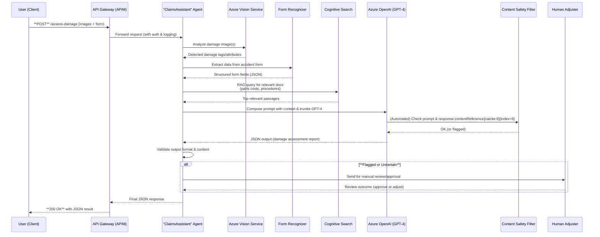

**Sequence Explanation:** This traces the end-to-end journey for one claim:

1. **User submits a claim** – e.g. via a mobile app or web client – by calling the REST API (`POST /assess-damage`). They include one or more photos of the car's damage and a scanned accident form. The request hits the **Azure API Management** gateway.
2. **API Gateway routes to Agent:** APIM verifies the request (e.g., checks a token, logs metadata) and forwards the payload to the backend **ClaimsAssistant Agent** (e.g. an Azure Function or Foundry endpoint).
3. **Vision Analysis:** The agent receives the images and calls the **Azure Vision Service** (Computer Vision or Custom Vision) to analyze each damage photo. The Vision service returns metadata – e.g. "dent in front bumper, \~30cm" or "cracked headlight lens" – depending on its capabilities. These findings are akin to what the Groq vision model provided, now obtained via Azure.
4. **Form OCR:** The agent then calls **Form Recognizer** with the accident report form image. FR returns structured fields: for example, it might output a JSON indicating which checkboxes (e.g. "Was anyone injured? \[No]") are ticked, textual descriptions of the accident from the form, etc. Now the agent has both *visual damage info* and *contextual form info*.
5. **Retrieval (RAG):** Using all the above data, the agent formulates a search query (for instance, including car model + damaged parts). It queries the **Azure Cognitive Search** index. The search service responds with a few relevant pieces of text: e.g. an entry from the parts database ("Front bumper for 2018 Toyota Camry: cost €400") and an excerpt from a repair manual about replacing a headlight. This provides real, up-to-date reference information.
6. **LLM Reasoning:** The agent now constructs a prompt for **GPT-4**. This prompt might say: "You are an AI claims adjuster. The user's car is a 2018 Toyota Camry. Damage: front bumper dent, left headlight cracked. Accident details: (form info...). Relevant info: (parts cost €400 for bumper, headlight unit €250, labor \~2h). Provide a JSON with `damages` list including part, severity, cost, and a `fraudCheck` field. The agent calls the **Azure OpenAI GPT-4** completion API with this prompt and instructions to output JSON following the predefined schema.
7. **Content Safety Filtering:** As part of the OpenAI service call, Azure automatically checks the **prompt and the model's response** for policy violations. (For example, if the user's input had slurs, or if the model tried to produce disallowed content, the filter would catch it.) Here, presumably everything is in domain (car repairs), so it passes.
8. **GPT-4 generates an answer:** GPT-4, using the prompt and provided data, produces a completion. For example, it might return:

   ```json
   {
     "damages": [
       {"part": "Front bumper", "severity": "Severe dent", "estimatedCost": 500},
       {"part": "Left headlight", "severity": "Broken", "estimatedCost": 300}
     ],
     "totalEstimate": 800,
     "fraudCheck": "No signs of fraud. Metadata analysis shows image is original."
   }
   ```

   The exact content depends on the prompt and the model's training, but importantly it should incorporate the factual cost info from search results (e.g. costs €400/€250 plus maybe labor) rather than making up numbers, thereby **grounding** its output in reality.
9. **Response Validation:** The agent receives the GPT-4 output. It now parses this JSON to ensure it matches the expected format (using a schema validation). It might correct minor format issues (if, say, the model included an extra field or a typo in keys). The agent also evaluates a confidence or sanity check – although GPT-4's answer is grounded, the agent can double-check e.g. if all required fields are present.
10. **Safety & Confidence Check:** If the Content Safety filter flagged the response (e.g. if the user's prompt was somehow inappropriate), or if the agent has any rule (e.g. claim estimate > €10k, or certain keywords present), the agent decides to route for **manual review**. In our sequence, we show an **alternative path**: if flagged or uncertain, the agent sends the case to a human.

    * In that path, the agent would perhaps create a review item (e.g. an entry in a database or Teams message) for a human claims adjuster to look at the images, form, and AI's suggested output. The human can then approve or adjust the output.
    * The human's decision is fed back into the agent (e.g. via a specific API or by the human editing the result in an interface).
    * Once the human confirms, the agent can proceed with that final decision as the output.
11. **Return Result:** Finally, if everything is fine (no manual review needed, or human has approved), the **agent returns the result** back to the API Management gateway. APIM in turn sends the HTTP 200 response with the JSON payload to the client.
12. **Client Receives JSON:** The end-user's app gets the structured JSON assessment and can display the results (e.g. list of damages with estimated repair costs) to the user, or further process it.

Throughout this process, Azure's platform provides **auditability**. Every call (Vision, FR, Search, OpenAI) could be logged. The content filter ensures compliance (no leaking sensitive info or policy breach). The latency of this single-agent chain remains **comparable to the original Groq solution** (each Azure API call is fast, and all are in-region). Token costs are also similar: GPT-4 is used with a grounded prompt, which might reduce unnecessary tokens by focusing only on relevant info. The agent can adjust temperature or max\_tokens to keep responses concise, keeping GPT-4 usage efficient. For straightforward cases, the cost is essentially the same as using GPT-3.5 if GPT-4 can be guided to output tersely – but Approach 2 will further address cost optimization via model routing.

**Outcome:** Approach 1 yields a **one-to-one replacement** of the original system purely on Azure. The user still sees a single black-box service (`/assess-damage` API) with JSON output. Internally, the AI now uses Azure's best-in-class services for each task (vision, OCR, search, GPT-4). There is no functionality loss – in fact, we gain stronger grounding (via Azure Search) and automatic content moderation. This approach is the simplest to implement on Azure, ideal for a quick migration from the Groq-based prototype. (It's essentially the same logical flow coded in Azure Prompt Flow or orchestrated with minimal refactoring.) The trade-off is that it relies on a single large model (GPT-4) for all reasoning; later approaches will explore using multiple models and agents for efficiency and scalability.

---

# **Approach 2: Azure Multi-Agent Mesh + Model Router**

*Approach 2 extends the architecture by splitting the logic into multiple specialized agents and introducing a **Model Router** to intelligently choose cheaper or faster models for easier tasks. The design is more complex but optimizes cost and performance.* All functionality can be achieved fully on Azure using **Azure AI Foundry's multi-agent orchestration** and the **Azure OpenAI Model Router**. We will detail how Azure resources support each piece: parallel agents, router for GPT-3.5/4, content safety, and human escalation – all within Azure.

## **Context Diagram (C4 Level 1)**

The context remains similar: the user interacts with an Azure-hosted claims AI service. The difference is internal – the "AI Assistant" is now composed of multiple collaborating agents rather than one monolith. Externally, the user experience and the involvement of a human reviewer on flagged cases are unchanged.

```mermaid
graph LR
    User["Insurance Customer or Agent"] -- claim request --> System[Claims AI Assistant (Azure, multi-agent)]
    System -- result JSON --> User
    System -- may escalate case --> Human["Human Claims Adjuster"]
    Human -- feedback/approval --> System
```

**Context Description:** From the outside, Approach 2's system is still a single "Claims AI Assistant" service. The **User** sends in claim data and gets back a JSON assessment. The **Human Adjuster** role is also present for manual review. The key difference (hidden from the user) is that within the **System**, multiple specialized AI agents handle different sub-tasks concurrently and then coordinate to produce the answer. This division of labor is not visible to the user, who still sees one unified service endpoint.

* **User:** Same as before, the client providing input.
* **Claims AI Assistant (Multi-Agent):** The overall system label for what is actually a collection of Azure agents working together (document ingestion agent, retrieval agent, reasoning agent, etc.). This grouping is what the user perceives as one service.
* **Human Adjuster:** Same external reviewer as before, engaged when needed.

In summary, context level remains the same; the solution is still fully on Azure and self-contained, just with an internal micro-agent architecture.

## **Container Diagram (C4 Level 2)**

Now we show the **containers** inside the multi-agent AI assistant. The architecture is broken into multiple agents, each running as an independent container (or process) in Azure's Agent Service. These agents communicate and pass data along (agent-to-agent calls). Additionally, we include a **Model Router** component that the reasoning agent uses to select the appropriate LLM (GPT-3.5, GPT-4, or a lightweight model) for a given request.

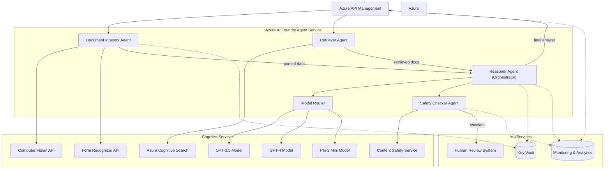

**Container Description:** The system is composed of multiple **Azure Foundry Agents**, each responsible for a subset of tasks. Azure AI Foundry's Agent Service allows us to deploy these as separate logical containers (with their own isolated prompt flows), and importantly to enable **agent-to-agent (A2A) communication** between them. The major containers are:

* **Azure API Management:** As before, the single entry point for client requests. However, unlike Approach 1 where APIM invoked one agent, here APIM can initiate multiple agent calls (potentially in parallel) thanks to the agent-to-agent orchestration API. In practice, APIM could call the first agent which then calls the next, or use a lightweight orchestrator to call two agents concurrently. We depict APIM initiating both the Document Ingestor and Retriever agents (taking advantage of multi-threading or asynchronous calls).
* **Document Ingestor Agent:** This Azure agent specializes in **input processing**. It ingests the raw inputs (images, forms) and produces structured data outputs for other agents to use. Internally, it will call the **Vision API** for damage images and **Form Recognizer** for the form, similar to Approach 1's steps. After extracting this info, the Doc Ingestor agent outputs a summary (e.g. "car: 2018 Camry; damage: bumper dent, headlight broken; form indicates no injuries"). This structured summary is then passed along to the next stage. In an agent-to-agent pipeline, Foundry can automatically pass the output of one agent as input to another – we link DocAgent to ReasonerAgent in the diagram (it could either directly call Reasoner or return to a supervisor which triggers Reasoner).
* **Retriever Agent:** This agent focuses on knowledge retrieval. It receives the query context (possibly directly from APIM or via a shared context). It queries the **Azure Cognitive Search** index to fetch relevant documents. It might be triggered in parallel to the DocAgent: e.g., if some initial query (like car model and generic query "common repair costs") can be done without waiting for full form parsing. Alternatively, it could wait for outputs from DocAgent to refine the search. In our depiction, APIM triggers it separately (illustrating potential concurrency). The Retriever calls **SearchAPI** and obtains documents. It then passes the retrieved snippets to the ReasonerAgent for final processing.
* **Reasoner Agent (Orchestrator):** This is the central coordinator that waits for results from the other agents (Doc and Retriever). Once it has the processed data (structured info from DocAgent and reference docs from RetrAgent), it proceeds to craft the final answer. It is responsible for interacting with the LLMs, and thus it leverages the **Model Router** to choose which model to use for the generation.
* **Model Router:** A specialized service (or component) that selects among multiple LLM deployments based on some criteria (complexity of query, load, etc.). On Azure, this can be implemented with a custom function or via Foundry's routing capabilities. For example, Azure might allow weighting rules or smart prompting to pick a model. In our case, the Router has access to:

  * **GPT-3.5** (a fast, cost-effective model),
  * **GPT-4** (a more powerful but expensive model),
  * **Phi-3 mini** (placeholder name for a smaller open-source model fine-tuned for very simple tasks – this could be an Azure-hosted custom model).
    These correspond to cost tiers. The **Reasoner Agent** sends the prompt to the Router, which decides: If the case seems straightforward (perhaps short prompt, low ambiguity), route to the cheaper model (Phi-3 or GPT-3.5). If it's complex (long description, severe accident, multiple damages), use GPT-4 for better reasoning. This dynamic selection can **cut costs by \~20–40%** by avoiding GPT-4 on easy queries (as hinted from internal analysis) – effectively "auto-dropping to Phi-3 for easy claims" as the LinkedIn insight suggested.
* **Safety Checker Agent:** Rather than handling content safety entirely inside the Reasoner, we factor it out to a dedicated agent (for modularity). The Safety agent receives the draft response from the Reasoner (and perhaps the original prompt too) and evaluates it for policy compliance or uncertainty. It utilizes Azure's **Content Safety** service (text moderation API) explicitly, and any business rules. If everything is fine, it lets the result pass. If not, it can trigger an **Escalation to Human Review**. (This agent could also do things like run a secondary LLM to double-check the answer's groundedness or run fraud heuristics.)
* **Human Review (Process/System):** Not an "agent" per se, but a component representing the integration point for human-in-the-loop. If the Safety agent flags the response, it will hand off to this human review system (could be an Azure DevOps ticket, a Power App for claims adjusters, etc.). The human adjuster reviews the case and provides an outcome (approve or edits). That feedback flows back to finalize the answer. We show **HumanReview** as an external system in AuxServices.
* **Azure Cognitive Services (VisionAPI, OCRAPI, SearchAPI):** The Document and Retriever agents rely on the same Azure services as before – we list them under *CognitiveServices*. They function the same as Approach 1, just called from different agents. (Vision and OCR likely called by DocAgent; Search by RetrAgent.)
* **Azure OpenAI Models (GPT-3.5, GPT-4) and Phi-3:** These are the model endpoints the Router can call. GPT-3.5 and GPT-4 are Azure OpenAI deployments. "Phi-3 mini" is presumably a smaller model – since Azure OpenAI might not have a "Phi" model, this could represent an open-source model hosted on Azure (perhaps via Azure Machine Learning or an Azure Function running a local model). It's included to illustrate that the router could integrate a non-OpenAI model for cost efficiency (provided it's deployed within Azure).
* **Content Safety Service:** The Safety agent uses Azure's Content Safety API to analyze text. (Even though OpenAI has filtering built-in, here we possibly double-check or enforce custom rules via an explicit call.) This service returns any flags for hate, violence, personal data, etc., which the Safety agent interprets.
* **Key Vault & Monitoring:** As before, we use **Azure Key Vault** for credentials, accessible by each agent that needs secrets (the diagram shows DocAgent and Reasoner using KV for their API keys, etc.). **Monitoring** is similarly integrated: APIM and each agent send logs/metrics to a central log analytics. This microservices setup benefits from **fine-grained monitoring** – e.g. we can track latency of Vision vs. Search vs. GPT calls separately, and identify bottlenecks easily. Azure's dashboard can show *Responsible AI metrics per agent*, since each agent is a container (this aligns with the note that we can get per-agent RA metrics).

**Parallelism & Orchestration:** One of the big advantages here is the ability to do tasks in parallel. In the diagram, APIM invokes **both** DocAgent and RetrAgent concurrently ("A2A API head in its own thread"). This means the form OCR and knowledge retrieval could happen simultaneously, potentially reducing overall latency. For example, while the form is being parsed (which might take a second or two), the retrieval agent can already fetch general info (like standard repair costs) that don't require form details, or use partial info (car model known from request metadata). They then converge at the Reasoner agent. Azure Foundry's multi-agent workflows support such patterns, using either a **Connected Agents** setup or a **Workflow** that handles synchronization. We assume here a simplified approach: APIM (or a lightweight orchestrator function) triggers both agents and then invokes Reasoner when both results are ready. Alternatively, Foundry allows an agent to call another: e.g. DocAgent could call RetrAgent internally once it has extracted some key info (chaining). Either design achieves a similar effect.

**Managed A2A:** Azure's Agent Service GA introduced the ability for agents to call other agents as tools. This means our ReasonerAgent could, in principle, directly call the Retriever agent as a "tool" when it needs info, rather than doing it in parallel externally. In that case, Reasoner would send a sub-request to RetrievalAgent mid-prompt (similar to an OpenAI function call). That's another valid design. We won't complicate with those details in the container view; the key point is each capability (OCR/vision, retrieval, reasoning) is encapsulated in its own agent container.

The end result is a **mesh of micro-agents** collaborating. This design improves modularity (each agent is simpler, focusing on one aspect). It also enables **dynamic scaling** – e.g. if OCR tasks are heavy, Azure can scale out the DocIngestor agent instances separately from the Reasoner. It also isolates errors; if one agent fails, it can possibly be retried without losing entire context (multi-agent workflow could have checkpoints). The cost benefits come from the **Model Router**: by using GPT-4 only when needed and cheaper models otherwise, token consumption can be optimized. (For instance, straightforward claims might run entirely on a fine-tuned smaller model at a fraction of GPT-4's cost, yet with Router oversight to switch to GPT-4 if the small model struggles.)

## **Component Diagram (C4 Level 3)**

Drilling down further, we illustrate how these agents interact internally and with each other. The component diagram will emphasize the flow of data between agents and the decision logic of the Model Router.

```mermaid
sequenceDiagram
    autonumber
    participant DocAgent as Document Ingestor Agent
    participant VisionSvc as Vision API Tool
    participant OcrSvc as OCR API Tool
    participant RetrAgent as Retriever Agent
    participant SearchSvc as Search API Tool
    participant Reasoner as Reasoner Agent
    participant Router as Model Router
    participant GPT_35 as GPT-3.5
    participant GPT_4 as GPT-4
    participant Phi3 as Phi-3 Mini
    participant Safety as Safety Agent
    participant CSAPI as Content Safety API

    Note over DocAgent,RetrAgent: **Parallel Stage:** Process images & retrieve docs
    DocAgent->>VisionSvc: Call Computer Vision (analyze images)
    DocAgent->>OcrSvc: Call Form Recognizer (parse form)
    VisionSvc-->>DocAgent: Damage tags/description
    OcrSvc-->>DocAgent: Extracted form data
    DocAgent-->>Reasoner: Emits structured claim data
    par in parallel
        RetrAgent->>SearchSvc: Query Cognitive Search (with initial info)
        SearchSvc-->>RetrAgent: Relevant knowledge docs
        RetrAgent-->>Reasoner: Emits retrieved text snippets
    and wait for DocAgent 
        DocAgent-->>Reasoner: (Already sent data)
    end

    Note over Reasoner: **Reasoning Stage:** Assemble prompt, choose model
    Reasoner->>Reasoner: Merge data (images & form info + docs)
    Reasoner->>Router: Send composed prompt for LLM
    alt Simple case (low complexity)
        Router->>Phi3: Use small model
        Phi3-->>Router: Draft answer
    else Moderate case
        Router->>GPT_35: Use GPT-3.5 Turbo
        GPT_35-->>Router: Draft answer
    else Complex case
        Router->>GPT_4: Use GPT-4
        GPT_4-->>Router: Draft answer
    end
    Router-->>Reasoner: Return LLM answer

    Reasoner-->>Safety: Pass answer (and context) for review
    Safety->>CSAPI: Content moderation check
    CSAPI-->>Safety: Flag status OK/Not OK
    Safety->>Safety: Apply business rules (confidence, cost thresholds)
    alt Needs human review
        Safety-->>Human: Escalate case for manual review
        Human-->>Safety: Human-approved/edited answer
    end
    Safety-->>Reasoner: Final validated answer
    Reasoner-->>(APIM): Respond with JSON result
```

**(Note: This is a combined component/sequence style diagram to illustrate inter-agent interactions and router logic.)**

**Component Interaction Details:** The numbered sequence above maps out the interplay between components across agents:

1. **Parallel Ingestion and Retrieval:** Document Ingestor and Retriever operate concurrently (steps 1–5 happen in parallel).

   * DocAgent calls **Vision API** and **OCR API** (as internal "tools" or external calls) to analyze images and forms. It then structures the output (damage details + form fields).
   * RetrAgent calls **Search** with whatever initial query it can (perhaps using metadata like car model or a generic query). It gets back docs (it might do multiple query rounds, or use a vector similarity search).
   * Both agents then emit their results. In an Azure workflow, these could be forwarded to the Reasoner agent. We show DocAgent output reaching Reasoner and RetrAgent output reaching Reasoner. The orchestration ensures Reasoner starts only after it has both inputs (either via explicit sync or because it's triggered after both agents complete).
2. **Reasoner Prepares Prompt:** The Reasoner agent component collates all information. It might create a prompt like:
   "Damage summary: front bumper dented, left headlight broken. Form info: speed 30km/h, clear conditions, no injuries. Retrieved info: (1) Bumper replacement cost \~€400 (2) Headlight part cost €250. Now generate assessment JSON."
   This internal step is not a separate container but a function inside Reasoner.
3. **Model Router Decision:** The Reasoner delegates the prompt to the **Model Router**. The Router component has logic (could be simple rules or an ML model itself) to decide which LLM to invoke:

   * If the prompt is short/simple (maybe a single minor scratch, trivial case), Router picks the **Phi-3 mini model**. (This could be an Azure ML endpoint hosting a fine-tuned smaller model capable of format-compliant output for simple inputs.)
   * If moderately complex, Router uses **GPT-3.5 Turbo** (faster and cheaper than GPT-4, but still quite capable for many tasks).
   * If very complex (multiple damages, contradictory info, potential injury, etc.), Router uses **GPT-4** for its superior reasoning.
     This selection could also consider runtime factors: e.g. if GPT-4 quota is near limit, it might divert some to 3.5; or if cost savings are paramount, lean toward cheaper models when confidence is acceptable. The Router essentially functions as a policy brain for cost-performance trade-off.
4. **LLM Draft Answer:** The chosen model (Phi-3, GPT-3.5 or GPT-4) generates a draft answer. The Router returns that output to the Reasoner. (We assume the Router encapsulates the API calls to those models; it might also attach a score or info which model was used, if needed for logging.)
5. **Safety Check & Business Rules:** The Reasoner passes the draft answer and context to the **Safety Checker agent**. The Safety agent:

   * Invokes **Content Safety API** on the LLM's output (and possibly on the user input again). The content filter returns flags (if any).
   * The Safety agent then applies any additional rules: e.g., *"If Content Safety flags violence/hate, auto-escalate"*; *"If total estimate > €5k, require human double-check"*; *"If model used was Phi-3 and confidence is low (maybe the answer has uncertain language), escalate"*, etc.
   * If any condition is triggered, the Safety agent will mark it for human review. Otherwise, it approves the AI-generated answer.
6. **Human Escalation (if needed):** In the alternate path, Safety agent would send the case to a human. The human would review the images, the form, and the AI's suggested JSON. The human might edit some values or add a note ("e.g. add comment that customer should still file police report for record"). That reviewed output is fed back as the final answer. (In practice, this could happen through the human using a portal that updates a database which the agent is polling, etc.)
7. **Final Answer to User:** The Safety agent gives the green-lighted final JSON back to the Reasoner (or perhaps directly to APIM, depending on orchestration). Here we show it going back to Reasoner, which then responds to the API call. The user receives the JSON result.

**Notable Details:**

* The **parallel execution** between DocAgent and RetrAgent is depicted with the `par ... and ... end` in the sequence. This reduces overall latency by overlapping I/O-bound tasks (OCR, search).
* The **Model Router** logic is key to cost optimization. For example, if the claim is something simple like "scratch on mirror", a tiny model might handle it. This could reduce cost significantly (small model might be an Azure Container Instance costing pennies). For more typical cases, GPT-3.5 might suffice at 1/10th the cost of GPT-4. Only in truly complex scenarios do we pay for GPT-4. This dynamic approach can yield **20–40% cost savings in token usage** over always using GPT-4 – a figure suggested by Microsoft's guidance on using model routing to cut business costs. It's essentially an **auto-MPC (Most Probable Cost) selection** where the system tries the cheapest capable model first.
* **Error handling:** If one of the sub-agents fails (say Vision API times out), the system could either retry that agent or still proceed with partial data. The multi-agent setup allows potentially more robust error strategies. For example, if OCR fails, the Reasoner could still attempt an answer using just image tags and retrieved data, but perhaps it would notice missing form info and decide to escalate. All this logic can be implemented in agents or the workflow.
* **Monitoring per agent:** Each agent can record metrics. For instance, how often the Router chose GPT-4 vs GPT-3.5 (giving insight into complexity distribution of claims), average latency of OCR vs search, etc. Fine-grained logs help pinpoint where improvements can be made (maybe the custom Phi-3 model underperforms on certain damage types – we'd see those cases often escalating to GPT-4 or human).

Overall, the component interactions in Approach 2 show a **modular pipeline**: input processing, retrieval, reasoning with model choice, and safety gating. This division of responsibilities adds some complexity but aligns well with Azure's **microservices and connected agents** architecture. Importantly, all parts (Vision, OCR, Search, multiple LLMs, content filter) are **Azure-managed or hosted**. No external services are needed – even the "Phi-3" model could be an open model deployed to Azure Machine Learning or an AKS container (so it stays within Azure). Thus, Approach 2 is fully Azure-based with complete functionality.

## **Deployment / Infrastructure Diagram**

We now map these agents and services onto Azure infrastructure. This shows how each agent might be deployed and how they connect (network-wise and resource-wise) in Azure. We ensure all components run in Azure EU regions.

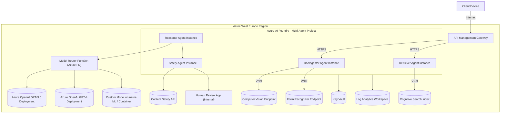

**Deployment Details:** This shows a possible deployment mapping:

* **Azure AI Foundry Agent Service (Project Hub):** Azure likely groups agents into a project/workspace. We have a subgraph "AgentHub" representing the environment where our agents run. Within it, each agent can run on one or more instances (depending on load). We label single instances for simplicity: **DocPod**, **RetrPod**, **ReasonerPod**, **SafetyPod**. In reality, Azure might run these as containerized workloads (perhaps on an AKS behind the scenes) that we don't manage directly – we just see them as hosted agents. The agents communicate over an internal mechanism (could be direct HTTP calls via internal endpoints or a message bus).

  * They likely share a **Virtual Network** if configured (so they can privately reach other Azure services).
  * The **Model Router** could be implemented as part of Reasoner's code, but here we show it as a separate **Azure Function** service (**RouterFn**). This function app is deployed in the same region, possibly in the same VNet, and contains the logic to call the appropriate model endpoint. (Alternatively, Router could be a simple code within Reasoner agent – but isolating it might ease updates to routing logic independently.)
* **API Management Gateway:** Deployed as before, it now needs to know about two initial agents (Doc and Retr). APIM can either call a single Orchestrator that fans out, or call both. If APIM directly calls both, it might be using an Azure Function or logic app behind the scenes to handle parallel calls. But we keep it conceptual: APIM triggers DocAgent and RetrAgent (via HTTP endpoints exposed by Foundry for those agents). APIM is outside the VNet (in public subnet) but communicates securely via SSL. The agents' endpoints can be protected (only APIM's IP or certain identity can call them).
* **Cognitive Services & OpenAI:** Vision, Form Recognizer, Search, Content Safety, GPT-3.5, GPT-4 are all Azure services/resources. We show them as separate nodes. They all can be integrated with the VNet via private endpoints.

  * The **VisionRes** and **FRRes** (Form Recognizer) have private endpoints such that the DocIngestor agent calls them over the Azure backbone (no public traffic).
  * **SearchIndexRes** likewise has a private endpoint for the Retriever agent.
  * **OpenAI35/OpenAI4** are the Azure OpenAI endpoints for GPT-3.5 and GPT-4; these support private network access as well, which the Router function can use (or the Reasoner agent via the router code).
  * **SmallModel** represents the deployed smaller model (Phi-3). This could be an **Azure ML online endpoint** or a **Container Apps** instance. For example, one could use Azure Container Instances or AKS to host a Flask API running a small model. We assume we've set that up in Azure, and the Router function knows the endpoint (which could also be within the VNet).
  * **ContentSafetyRes** is the Content Safety API endpoint (Azure AI Content Safety resource). The Safety agent calls it, likely it's a public endpoint (content safety might not have private link yet, but it's an Azure service in region). The call goes out securely.
* **Human Review Portal:** This is an internal application for adjusters. It could be a web app connected to the same Azure AD tenant. The Safety agent, upon escalation, could create a record in a database or send a notification. The human then uses this portal to see the case. That portal might allow them to modify the JSON or confirm it. Once done, the Safety agent is unblocked (could poll or be notified via a queue). We depict **HumanPortal** connecting to the Safety agent for feedback. The specifics can vary (it might be an offline process in some implementations).
* **Key Vault & Logs:** All agents likely use a shared Key Vault for secrets (Search API keys, OpenAI keys). The **AgentHub** (project) would have an identity to access Key Vault. We show the connection from the agent environment to **KVVault**. Also, all agents push logs to a central **Log Analytics** workspace. APIM also logs to Monitor. This consolidated logging ensures we can trace a single user request across agents (using correlation IDs).
* **Networking & Security:** All components are within the Azure West Europe region to maintain data locality. The **VNet** (if used) provides isolation; private endpoints (as indicated by lines from agents to service resources labeled "VNet") ensure no data goes to the public internet when calling Azure services. APIM is public-facing but can be locked to certain IPs or require client certs etc., as needed. Communication between agents can happen via internal APIs – likely the Foundry service handles that through its orchestration features without exposing them publicly.
* **Scaling:** Each agent container can scale out (e.g. multiple DocAgent instances if many requests in parallel). Azure Foundry can manage scaling or we can allocate a certain compute size per agent. The Router function can also scale out if under heavy load (Azure Functions consumption plan). The Search index resource can be scaled (more replicas for higher QPS). All of this can be tuned to meet performance demands.

This deployment is more complex but offers **resilience**. If, say, the Vision service is temporarily down, the DocAgent could continue with OCR and note missing data. Or if GPT-4 is overloaded (hitting rate limits), the Router might automatically use GPT-3.5 or queue requests. Each piece can be updated independently – e.g., we can retrain the Phi-3 model and deploy a new version without touching the other agents.

From a **DevOps perspective**, we now have multiple components to manage (which is a con: heavier cognitive load for developers). Monitoring dashboards must cover each agent and model. Azure provides per-agent dashboards in Foundry (with telemetry for each microservice) and even Responsible AI reports per agent, which can help ensure each agent's function is interpretable and within policy.

In summary, the infrastructure is fully Azure-native: using Azure AI Foundry for multi-agent orchestration, Azure OpenAI and Cognitive Services for AI tasks, and standard Azure services (APIM, Key Vault, Monitor) for integration. All functionality from the original scenario is not only preserved but enhanced: *parallelism speeds up processing; model routing reduces cost; separate safety agent adds an extra layer of governance.* The only downside is complexity and the need to maintain multiple moving parts.

## **Nominal Sequence Diagram (Key Scenario)**

Below is a sequence flow for a typical claim in this multi-agent setup, highlighting parallel execution and model routing:

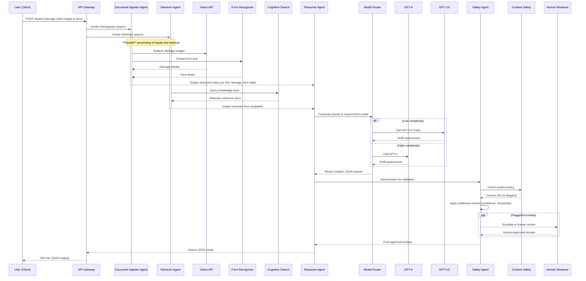

**Sequence Explanation:**

* **Parallel Input Handling:** APIM triggers both **DocAg** and **RetrAg** in parallel (represented by the parallel activation bars). DocAg calls Vision and OCR (in sequence internally) and returns structured data. RetrAg queries Search and returns docs. These steps run concurrently, reducing total time.
* **Coordination:** The **Reasoner agent** waits until it receives both the structured data from DocAg and the docs from RetrAg. Once it has them, it forms the combined context for LLM.
* **Dynamic Model Choice:** Reasoner delegates to **Router** to pick a model. The diagram shows an `alt` with two branches: one where GPT-3.5 is used (for a low complexity case) and one where GPT-4 is used (for a high complexity case). (We omit Phi-3 here for simplicity – it could be another branch for ultra-simple cases.)
* **LLM Response:** The chosen model returns an answer which the Router hands back to Reasoner.
* **Safety Check:** Reasoner passes the answer to SafetyAg. SafetyAg invokes **Content Safety** (CS) to scan the text. If content is fine and all business rules pass, it proceeds. If not, there's an `opt` (optional) section: the case is escalated to **Human**. The human reviews, then provides an approved answer.
* **Finalization:** SafetyAg sends the final vetted answer to Reasoner. Reasoner then responds to the API call via APIM. The user receives the JSON as usual.

**Notable Points in Sequence:**

* The sequence confirms that from the user's perspective, the parallelization and internal routing are transparent; they still get a single response, likely slightly faster than Approach 1 due to concurrency.
* The **Model Router** branch ensures that if, for example, the claim was simple, GPT-3.5 handled it entirely (saving cost). If it was complex, GPT-4 was used (ensuring quality at higher cost). This automatic decision happens within milliseconds based on prompt analysis or predefined triggers (like number of damages).
* If a **human review** occurred, it obviously introduces more latency (could be minutes or hours if offline). This is typically for exceptional cases.
* Throughout the sequence, all calls (Vis, OCR, Search, OpenAI) are **within Azure**. There is no call to any external provider or service – thus fulfilling the "fully on Azure" requirement.

**Functionality Preservation:** Every function from the original system is accounted for:

* Vision analysis (via Azure Vision),
* Form OCR,
* Data retrieval for grounding,
* LLM reasoning to produce JSON,
* Fraud detection or metadata analysis (this could be integrated in Safety agent or in DocAgent as part of image processing – e.g., DocAgent could use EXIF metadata to detect if photo might be edited, similar to original fraud utils),
* Human escalation.
  Additionally, Approach 2 introduces:
* Improved *cost efficiency* (router),
* Improved *scalability* (parallel agents),
* Better *observability* (per-agent logs),
* More *maintainability* (each agent's code is focused, e.g., OCR logic vs prompt logic separated).

Thus, Approach 2 is a fully Azure-native, production-grade architecture that **meets all functionality requirements** and optimizes them. The complexity is higher, but Azure's managed services (Foundry Agent Service, etc.) are designed to handle such multi-agent orchestrations, making it feasible to implement and maintain. This is ideal when cost control and resilience are top priorities, and you don't mind the additional engineering overhead to set it up.

---

# **Approach 3: Hybrid Vision (Azure-Hosted) + Azure Agent Mesh**

*In Approach 3, we combine a specialized vision AI model with Azure's agent-based reasoning system. Originally, this approach proposed using Groq's Maverick vision model for superior image analysis, paired with Azure for everything else. **To do it fully on Azure,** we replace the external Groq model with an **Azure-hosted equivalent** (e.g. a custom vision model or upcoming multimodal GPT-4 capabilities). This way, we retain advanced image understanding without leaving Azure.* The rest of the architecture mirrors the multi-agent mesh from Approach 2, including model routing and RAG, so functionality is preserved fully on Azure.

## **Context Diagram (C4 Level 1)**

Externally, the context remains the same as prior approaches: user calls the service, and a human may review if needed. The difference in Approach 3 is mainly internal (which vision system is used). We'll highlight that the system uses a *specialized Vision AI model* hosted in Azure to analyze images with high accuracy.

```mermaid
graph LR
    User["Insurance Customer / Agent"] -- submits photos & form --> System[Claims AI Assistant (Hybrid Vision)]
    System -- returns assessment JSON --> User
    System -- can request review --> Human["Expert Damage Assessor"]
    Human -- updated decision --> System
```

**Context Description:** The *Claims AI Assistant* is again an Azure-hosted service. The term "Hybrid Vision" here means we use a custom or specialized vision component in conjunction with Azure's agent mesh. The user and human roles are unchanged. The user doesn't see any difference – they still get a result JSON. The **Human Assessor** might be more rarely needed if our vision model is very accurate.

* The only subtle difference to note contextually: because we use a very fine-grained vision model (comparable to Groq's Llama-4 Maverick which excelled at dent detection), the system may catch image details better. So the user might receive more precise damage info. But from context perspective, that's just an improved service quality, not a new actor or interface.

In summary, context remains a single service interface, fully within Azure's domain.

## **Container Diagram (C4 Level 2)**

For Approach 3, the architecture can be seen as a blend of Approach 2 and a specialized vision service. In the original hybrid plan, an external GroqVision module fed into an Azure Agent. Now, we create an **Azure-hosted Vision AI service** to take that role. The rest of the containers (search, OpenAI, router, etc.) are as in Approach 2. We might simplify the agent breakdown depending on design – e.g., possibly keeping a single orchestrator agent since vision is handled by an external step. However, to maximize parallelism, we can still have multiple agents. Let's illustrate a variant: using a dedicated **Vision Analysis service** (custom model on Azure) feeding into a simplified agent flow.

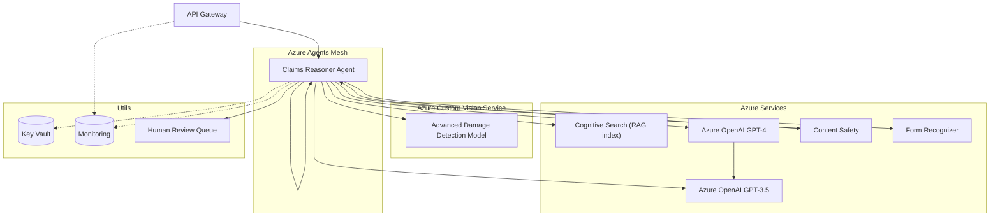

**Container Description:**

* **Azure Custom Vision Service (VisionModel):** We deploy or use a custom-trained model in Azure for fine-grained vehicle damage analysis. This could be implemented in two ways:

  * **Custom Vision AI (part of Cognitive Services):** Azure offers Custom Vision, where you can train a model with your own images (e.g., thousands of car damage photos labeled by type/severity). Once trained, Azure hosts this model as an endpoint. We could have a model that detects dents, scratches, cracks with bounding boxes and severity classification. This would mimic Groq's Maverick performance. The diagram's "VisionModel" in "Azure Custom Vision Service" represents this hosted model.
  * **Azure ML or Container:** Alternatively, if we have an open-source model (like a specialized YOLO or a fine-tuned LLaVA model for automotive damage), we could deploy it on Azure ML or as a container in AKS. That would similarly give us an endpoint on Azure to call for image analysis. Either way, the heavy-lifting vision model runs in Azure. We denote it separately to highlight its specialized nature.
* **Claims Reasoner Agent (CoreAgent):** Instead of multiple small agents, Approach 3 can be implemented with a **single orchestrator agent** that calls all necessary tools. (The original approach description implied a single "AgentCore (mesh)" after the vision component, meaning a primary agent that handles reasoning, search, etc.) We show **CoreAgent** as this main agent. It will:

  * Accept inputs from APIM.
  * Call the **VisionModel** service to get detailed damage info.
  * Call **Form Recognizer** to parse the form.
  * Call **Search** for RAG.
  * Use either an internal **Model Router** or simple logic to choose GPT-4 or GPT-3.5 (we illustrate both going from CoreAgent).
  * Invoke Content Safety (which can be automatic with Azure OpenAI, but the agent can also explicitly ensure compliance).
  * Handle human review triggers.

  Essentially, CoreAgent here is similar to Approach 1's single agent but enhanced: it uses a superior custom vision model (rather than the generic Azure Vision). It might also still use model routing for cost (which we depict by it calling GPT-3.5 and GPT-4 directly; presumably, it contains logic to pick one).
* **Azure Cognitive Search, OpenAI, Form Recognizer, Content Safety:** These services are the same as in prior approaches. They function as described before. The CoreAgent uses them as needed. Notably, with a very accurate vision model, the agent might supply more precise search queries (e.g., identifying specific part names from images).
* **Human Review Queue:** Same concept – if the agent is unsure or policy requires, it will output to a queue or system for human adjuster to review.
* **Key Vault & Monitoring:** Same usage – storing secrets, capturing logs.

So effectively, Approach 3's container layout is like Approach 1's single agent approach but swapping out the vision component for a custom one, and possibly still doing multi-model routing inside the agent. In practice, one could also implement Approach 3 with the multi-agent pattern of Approach 2 *plus* a custom vision:

* E.g., Document agent uses a custom vision instead of Azure's default.
* We decided to show the simpler variant for brevity: one agent orchestrating everything after getting vision data.

**Why the hybrid?** Because Azure's off-the-shelf Vision API might not detect *fine-grained dent geometry or subtle damage* as well as a specialized model or Groq's model did. By training our own model on Azure (or using something like GPT-4's vision if available via Azure OpenAI in future), we aim to match that functionality **without needing Groq's cloud**. This keeps everything in Azure and avoids any "loss of functionality" – we maintain high accuracy in vision tasks.

To summarize: All containers are Azure-hosted. The VisionModel is custom but on Azure, so we are not calling an external vendor; it's either our model or a service provided by Azure that we configured. The rest (search, GPT-4, etc.) are Azure services as usual.

## **Component Diagram (C4 Level 3)**

We'll focus on how the CoreAgent orchestrates the steps with the specialized vision model, and how the model routing might happen inside. Components include the interaction between the custom vision inference and the rest of the pipeline.

```mermaid
flowchart TD
    subgraph CoreAgent_Orchestrator
      A0[Receive request] --> A1[Call Custom Vision Model]
      A1 --> |Image insights| A2{Form Present?}
      A2 -->|Yes (form)| A3[Call Form Recognizer]
      A2 -->|No form| A4
      A3 --> A4[Compose query with vision+form data]
      A4 --> A5[Search knowledge base]
      A5 --> A6[Compile prompt with data & docs]
      A6 --> A7{Choose LLM model}
      A7 -->|Simple| A8[Call GPT-3.5]
      A7 -->|Complex| A9[Call GPT-4]
      A8 --> A10
      A9 --> A10[Parse & inspect answer]
      A10 --> A11{Safe & Confident?}
      A11 -->|No| A12[Flag for human review]
      A11 -->|Yes| A13[Return JSON answer]
    end
```

**Component Logic Explanation:**

* **A1: Call Custom Vision Model** – The agent sends the car damage images to the custom vision model. This returns detailed annotations: e.g., identifies each damaged part, type of damage, severity. Perhaps it outputs something like: `[{"part":"Front Bumper","damage":"Dent","severity":0.8}, {"part":"Left Headlight","damage":"Shatter","severity":0.9}]`. These insights are more structured than a generic description.
* **A2: Check if Form Present** – The agent checks if an accident report form was provided (in many cases yes, but if not, skip OCR).
* **A3: Call Form Recognizer** – If a form image is included, perform OCR to extract details (driver statements, etc.).
* **A4: Compose Search Query** – The agent now has:

  * List of damaged parts (from vision),
  * Maybe estimated severities or affected areas,
  * Possibly car make/model (either user input or OCR might contain it, or even vision model could identify car model if trained for it),
  * Accident context from the form (like weather, speed).

  Using these, the agent crafts a query or multiple queries for Azure Search. For instance: `"Toyota Camry 2018 front bumper replacement cost"` and `"2018 Camry headlight repair manual"`. Essentially, it grounds the query in specifics. This is likely to retrieve highly relevant info (cost figures, official repair steps).
* **A5: Search Knowledge Base** – The agent queries Cognitive Search with the composed query(s). It gets back relevant docs/snippets, similar to previous approaches.
* **A6: Compile LLM Prompt** – The agent assembles all context for the LLM:

  * A summary of vision findings ("The car's front bumper is heavily dented and the left headlight is shattered."),
  * Key data from the form ("No injuries; collision at \~30km/h; clear weather"),
  * Retrieved facts (e.g., "Front bumper part costs \~€400, \~3 hours labor; Headlight assembly costs €250"),
  * Instruction to output in JSON format with specific schema.
* **A7: Choose LLM Model** – Inside the agent, a decision is made whether the prompt requires GPT-4 or GPT-3.5. This could be a simple rule: if multiple severe damages or if the form text is complex (or certain trigger phrases), use GPT-4; otherwise GPT-3.5. We depict it as a branching decision.
* **A8/A9: Call LLM** – The agent calls the chosen model via Azure OpenAI. GPT-3.5 for simpler cases, GPT-4 for complex. They return a draft answer.
* **A10: Parse & Inspect Answer** – The agent parses the JSON answer and inspects it. Since we have a powerful vision model, we expect the answer to closely reflect actual damage. The agent can verify if all identified damages were addressed in the answer. If something is missing (e.g., vision found 2 damages but LLM output only 1), the agent might prompt the LLM again or adjust. This is a possible improvement in Approach 3: the agent can trust the vision model's count of damages and ensure the final output covers each, thus increasing accuracy.
* **A11: Safe & Confident?** – The agent checks content safety and its own confidence. By default, Azure's content filter ran on the OpenAI call, but the agent may still double-check. If the LLM output is not in JSON or seems off, confidence is low.
* **A12: Flag for Human Review** – If not safe or confident, go to human (same as before).
* **A13: Return JSON Answer** – If all is good, output the final JSON to the client.

This component workflow is essentially Approach 1's logic, but boosted by a better image understanding at A1. In other words, Approach 3 tries to **preserve Groq's superior vision capability by using an Azure alternative**. This ensures no loss in functionality – we still get fine-grained damage analysis. Possibly, Approach 3 yields the **best visual accuracy** among the Azure-only solutions (assuming our custom model is good), just as originally intended with Groq's model.

One might ask: could Azure OpenAI's GPT-4 Vision (multimodal) handle the image directly, instead of a custom model? If by 2025 Azure offers GPT-4 with image input, that is another route – you could feed the image to GPT-4 and have it analyze it. However, GPT-4's vision might not be as specialized for vehicle damage as a dedicated model. So depending on availability, one might still prefer a custom model (or a combination: use GPT-4 Vision to double-check the custom model's findings, etc., but that's beyond scope). In any case, Approach 3's essence is using **two different AI systems: one for vision, one for language** – each best in class – all under Azure's roof.

## **Deployment / Infrastructure Diagram**

We show how the custom vision model and the rest are deployed in Azure:

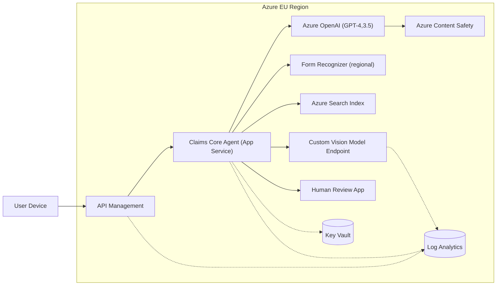

**Deployment Highlights:**

* **Custom Vision Model Endpoint:** This could be an Azure **Cognitive Services Custom Vision** endpoint. If so, Azure hosts it and provides an API key/endpoint. Alternatively, it could be an Azure **Container Instance or AKS** running our model. In either case, it's deployed in Azure EU region. We show it as "VisionContainer" which might imply a container deployment. We ensure it's in the VNet or accessible to the Agent.
* **Claims Core Agent App:** We depict the Core agent as an App Service (or Azure Function) called "AgentApp". If using Azure AI Foundry, it could be one agent in the project. Or we might implement it as a custom FastAPI app that calls the services (though Foundry agent would be easier for integration). Either way, it runs in Azure, presumably with VNet access to call the private vision endpoint and search.
* **Networking:** AgentApp calls VisionContainer likely within the same VNet (if container or custom vision supports private link). FRService and SearchIndex can be via private endpoints. Azure OpenAI and Content Safety similarly either via private link or at least region-local endpoints. We assume all these resources are in West Europe (or another EU region).
* **OpenAI Service**: It includes both GPT-4 and GPT-3.5 deployments under the hood. The agent will specify which deployment to use.
* **Monitoring and KV:** Same as before. We would monitor the VisionContainer's performance and logs as well (it's custom, so we need to gather logs from it too, e.g., via App Insights or Log Analytics).

So infrastructure-wise, Approach 3 is very achievable on Azure. It does not rely on Groq's cloud at all – we have simply transplanted the vision piece into Azure. We might have to invest in training that model or using one from Azure Marketplace. (Interestingly, the comparison matrix in the prompt indicated Approach 3 has "No GPU infra" as a pro. Azure can run custom models on CPU or FPGA if needed, or on Azure GPU VMs if using something heavy – but as a user of Azure's Custom Vision service, we don't manage GPUs directly, Azure does. So it's still managed from our perspective.)

Finally, since Approach 3 still uses the model router concept (router weights governed by policy in Approach 2 and 3), we might mention: even in Approach 3 we can incorporate cost-awareness. If the simpler model (Phi-3) from Approach 2 is deemed unnecessary because we want high accuracy always, we might just stick to GPT-4 and skip router. However, the table suggested Approach 3's router uses Φ-3 and GPT-4 (omitting GPT-3.5) – possibly they assumed moderate cases still need quality so they didn't plan to use 3.5. But that's detail; we can still consider model selection as a feature.

## **Nominal Sequence Diagram (Key Scenario)**

This sequence will look much like Approach 1's, but highlighting the use of the custom vision model:

```mermaid
sequenceDiagram
    participant User as User
    participant APIM as API Gateway
    participant Agent as Claims Agent (Orchestrator)
    participant VisionSvc as Custom Vision Model
    participant FR as Form Recognizer
    participant Search as Azure Search
    participant LLM as Azure OpenAI (GPT-4/3.5)
    participant Safety as Content Safety Filter
    participant Human as Human Adjuster

    User->>APIM: POST /assess-damage (images, form)
    APIM->>Agent: Forward request to agent
    Agent->>VisionSvc: Analyze images (custom model)
    VisionSvc-->>Agent: Detailed damage report (parts & severity)
    Agent->>FR: OCR accident form
    FR-->>Agent: Extracted form data
    Agent->>Search: Query index with specific parts & context
    Search-->>Agent: Retrieved cost/manual info
    Agent->>LLM: [If simple, use GPT-3.5; else GPT-4] -> Generate JSON answer
    LLM->>Safety: Automatic content safety check
    LLM-->>Agent: Draft assessment JSON
    alt Needs human verification
        Agent->>Human: Escalate for review
        Human-->>Agent: Human-approved JSON
    end
    Agent-->>APIM: Return final JSON response
    APIM-->>User: 200 OK (assessment result)
```

**Sequence Explanation:**

* The user request goes through APIM to the Agent.
* The **Agent first calls the Custom Vision model**. The Vision service returns a **detailed damage report** – which is richer than the generic tags in Approach 1. (For example, "dent (30cm) on front bumper, crack on left headlight lens, no other visible damage".)
* The agent then calls **Form Recognizer** for the accident form, as usual.
* With both, the agent performs a **targeted search** on Azure Search. Because it knows exactly which parts are damaged and the car details, the search is efficient. (It might even do direct index lookups by part number if the vision model can identify part IDs – not likely directly, but it could identify part names.)
* The agent then calls **Azure OpenAI LLM**. If the case is straightforward, it might choose GPT-3.5; if not, GPT-4. This is noted as "[If simple, use GPT-3.5; else GPT-4]" in the sequence. We didn't split it fully to alt blocks for brevity, just described it inline.
* Azure OpenAI does an internal **content safety check** on the prompt/response. The model returns a JSON draft.
* If the agent finds anything missing or if any rule triggers, it goes to **Human review** (optional alt).
* Finally, the agent returns the JSON to the user via APIM.

Comparing to Approach 1's sequence, the only differences:

* Use of **VisionSvc** (custom model) with more granular output.
* Possibly more direct search queries (less guesswork needed).
* The presence of a model choice (GP-3.5 vs GPT-4) which we alluded to.

Everything else – OCR, search, LLM reasoning, safety – is the same flow. Thus, Approach 3 on Azure achieves the **"best image understanding"** goal by using a specialized Azure vision model, while still being fully on Azure. There's **no external call**; even our fancy vision model is hosted on Azure.

**No Loss of Functionality:** In fact, if our custom model is good, there's no loss at all – we might even gain accuracy in image analysis compared to using a generic model. The only potential downside originally noted was the complexity of having a two-vendor solution (Groq + Azure) and network latency. By bringing the vision model into Azure, we remove that downside:

* **Outbound call crosses internet** – no longer, it's within Azure (or at least from Azure to Azure if custom vision is a cognitive service call).
* **Two vendors to audit** – gone, it's all Azure now (though we still maintain our custom model, but it's under our Azure subscription).

The trade-off: we have to develop/maintain the custom model. But Azure's Custom Vision makes training relatively easy (few-shot or using Azure AutoML). Also, using a custom model means we must monitor its performance and update it with new data (if car designs change, etc.). However, that's a known effort if we want top-tier accuracy.

Approach 3 is likely beneficial if the insurance company values **highly accurate damage detection** (maybe to minimize missed damages or false claims) more than the simplicity of Approach 1. It is still entirely Azure-hosted and integrates with the same reasoning and RAG pipeline.

---

# **Approach 4: MCP-Compliant Mesh (Azure Open, Future-Proof)**

*Approach 4 envisions an **open, interoperable agent ecosystem** using the **Model Context Protocol (MCP)** – a vendor-agnostic standard for connecting AI agents and tools. On Azure, this can be fully implemented by leveraging Azure AI Foundry's support for MCP and integrating Azure services (search, SQL, etc.) through that protocol. All functionality remains, and this design adds long-term flexibility: the system can incorporate or switch out models/agents from different vendors in the future, all within Azure's framework.*

## **Context Diagram (C4 Level 1)**

At the context level, Approach 4 is still the same claims AI service for the user, but now explicitly designed to allow external integrations. The user interacts with an **MCP Gateway** as the entry point, which could allow other AI systems to connect too (e.g., corporate chatbots or third-party agent clients). However, for the insurance customer, it's still one service. A human reviewer is still involved when needed.

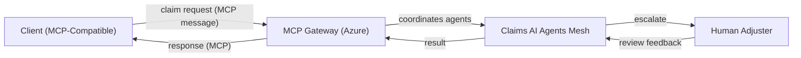

**Context Description:**

* **MCP Gateway:** This is essentially the front-end of the AI system, speaking the **Model Context Protocol**. MCP is an open protocol that standardizes how AI assistants invoke tools and how external clients interact. In practice, the MCP Gateway could be an Azure Function or a web service that adheres to the MCP spec. It could accept requests from an **MCP-compatible client** (the user might be using a special client or maybe a normal HTTPS call that the gateway translates to MCP format).
* For the user (could be the insurance company's app), this gateway functions similarly to APIM, except it's protocol-aware for AI. It can route tasks to various internal agents seamlessly.
* **Claims AI Agents Mesh:** This represents the internal specialized agents (like Retrieval, SQL, LLM, Safety, etc.) that will fulfill the request. The difference from Approach 2 is that their integration is done via MCP messages rather than proprietary linking. This means our system can theoretically call out to any MCP-compliant tool or agent. For example, if in future a new AI model from another provider supports MCP, we could plug it in.
* **Human Adjuster:** Still present for manual review. Possibly even the human interface could be integrated via MCP (like a human-in-the-loop agent that responds via an MCP client), but that's an aside.

So context-wise, the introduction of MCP Gateway means our system can talk a common language with external AI components. But **all functionality remains within Azure for now**; we're just preparing for multi-platform interoperability.

## **Container Diagram (C4 Level 2)**

This will look somewhat like Approach 2's multi-agent, but now explicitly showing the **MCP Gateway** and some additional agent (like a SQL Grounding agent). Also, we consider Azure SQL as a data source for cost tables (the original text for Approach 4 highlighted SQL grounding for labor rates). All components still run on Azure.

```mermaid
graph TD
    Gateway["Azure MCP Gateway Service"]
    subgraph Azure Agent Service (MCP Project)
      SQLAgent["SQL Grounding Agent"]
      SearchAgent["Retrieval Agent"]
      LLMAgent["LLM Orchestrator Agent"]
      SafetyAgent4["Safety/Compliance Agent"]
    end
    subgraph DataSources
      SQLDB["Azure SQL Database\n(Cost & Rates)"]
      SearchIndex4["Azure Cognitive Search\n(Knowledge)"]
    end
    subgraph Models
      Router4["Model Router"]
      GPT4_azure["Azure GPT-4"]
      GPT35_azure["Azure GPT-3.5"]
      OSModel["Optional: Other Model (HuggingFace)"]
    end
    subgraph External (Future/Optional)
      ThirdPartyAgent["3rd-Party Agent (MCP client)"]
    end
    subgraph Aux
      ContentSafety4["Content Safety API"]
      HumanReview4["Human Review Process"]
      Monitor4["Monitoring & Trace"]
    end

    Gateway --> LLMAgent
    Gateway --> SearchAgent
    Gateway --> SQLAgent
    Gateway --> SafetyAgent4
    LLMAgent --> Router4
    Router4 --> GPT4_azure & Router4 --> GPT35_azure & Router4 --> OSModel
    SearchAgent --> SearchIndex4
    SQLAgent --> SQLDB
    SafetyAgent4 --> ContentSafety4
    SafetyAgent4 --> HumanReview4
    ThirdPartyAgent -.-> Gateway
    LLMAgent -.-> Monitor4
    SearchAgent -.-> Monitor4
    SQLAgent -.-> Monitor4
    Gateway -.-> Monitor4
```

**Container Description:**

* **MCP Gateway:** This is a service that orchestrates and mediates communications via MCP. In Azure, one could implement it by using Azure AI Foundry's built-in MCP server capabilities. The gateway listens for requests (which might contain an MCP conversation or a goal) and knows which internal agents/tools are available (it registers our SearchAgent, SQLAgent, etc. as MCP tools). The gateway dispatches tasks accordingly, possibly in parallel or as directed by the LLM agent. This gateway might be realized as a lightweight web service or part of the Foundry agent service configuration (the Azure Foundry blog described setting up an MCP server that connects to Azure agents).
* **SQL Grounding Agent:** A new component not explicitly shown in earlier approaches. This agent's job is to answer queries from the LLM by directly querying an **Azure SQL Database** that contains structured data (like region-specific labor rates, parts prices that might be easier to query via SQL than via search). For example, if the LLM needs "hourly labor cost in Paris region", it can delegate to SQLAgent. The SQLAgent would run a parameterized query on the SQLDB and return the result (e.g., €100/hr) to the LLM. This is the **"SQL grounding"** mentioned, adding an extra data source beyond the search index.

  * The Azure SQL DB could hold up-to-date price tables, which might be maintained by the company's IT. Using SQL directly ensures the LLM gets live data, not stale indexed data.
* **Retrieval Agent (SearchAgent):** Similar to earlier retrieval agent – handles RAG via Cognitive Search. The difference is now this agent could also handle *web search* if needed, since MCP could allow plugging in a Bing search tool. But assuming we stick to private data, it queries the Azure Search index.
* **LLM Orchestrator Agent (LLMAgent):** This agent is the main reasoning agent. It receives the user query via MCP and internally it can decide to call tools (like the SearchAgent or SQLAgent) by issuing MCP "actions". In an MCP flow, the LLM agent might have a prompt that says: *"If you need data, you can use tools X, Y."* Then at run-time, it will output a structured message like `Action: SearchAgent query="find part cost for bumper"`. The MCP Gateway will route that to SearchAgent, get the result, then feed it back. Same for SQL. The LLMAgent then composes the final answer. Essentially, this is an **agent with tool-use** – MCP provides the standard way to do it, similar to OpenAI function calling but in a multi-agent context.

  * The LLMAgent uses a **Model Router** internally (or just calls a router tool) to pick GPT-4 vs GPT-3.5 or others, just like Approach 2. It might even have access to the custom model from Approach 3 or any new model. In our diagram, Router4 can call Azure's GPT-4, GPT-3.5, or an **OSModel** (open-source model) – illustrating that MCP being open, we could incorporate a HuggingFace model if needed. But for fully Azure, that OSModel could be one we host on Azure.
* **Safety/Compliance Agent:** This agent monitors the conversation and results for safety. It likely wraps around Content Safety API like before. Under MCP, it might be called automatically on every output (the gateway or LLMAgent could ensure to pass content to SafetyAgent for approval before finalizing). If SafetyAgent flags something, it can instruct LLMAgent to halt or modify. Or it can trigger the **HumanReview** process as depicted. This agent thus ensures Responsible AI practices are followed uniformly across all interactions.
* **Data Sources:** **Azure SQL DB** and **Azure Search Index** are the two main data sources. By having both, the agent has a richer toolkit. For example, Search covers unstructured docs, SQL covers structured records. MCP allows the LLM to pick the right one. This prevents the need to shoehorn everything into a vector index; some numeric or tabular data is best kept in SQL. (E.g., labor rates by region or historical claim stats for fraud detection – those fit SQL.)
* **Model deployments:** We still have **Azure OpenAI GPT-4 and GPT-3.5** as our core models. The **Router4** could be an agent or service that decides which to call. Alternatively, we might directly call a specific model based on system prompt direction. We include **OSModel** to indicate the system is open to integrate other models (maybe an on-prem model or another provider's via MCP).

  * *Note:* MCP being vendor-agnostic, if one day the company wants to try an Anthropic Claude model or a new GPT-5 from OpenAI, they could integrate via MCP connectors without redesigning the whole system. But for now, fully Azure means we use Azure-hosted models.
* **ThirdPartyAgent (Optional):** We show an external possible agent connecting (dotted). For instance, if a partner (like a car repair shop's system) had their own agent that speaks MCP, they could query our system's agents via the gateway. This is a forward-looking possibility that the architecture allows. It doesn't change internal function, just illustrates the interoperability benefit.
* **Monitoring & Trace:** With MCP, tracing becomes important (messages hop between agents). **Monitor4** collects logs from Gateway and all agents, giving end-to-end insight. Azure's Foundry presumably can track MCP tool calls in its logs (if not, we might need custom tracing IDs in messages). This ensures we can debug and audit easily, even across different tool boundaries.
* **Key Vault** (not explicitly drawn above but assumed) would still store credentials (search keys, DB connection strings).

This architecture is "future-proof" in the sense that it **abstracts the connections between components** – everything communicates via a protocol, not hardcoded links. Microsoft's integration of MCP in Azure means our solution is aligned with where Azure is heading for AI interoperability. So if a new Azure service or external tool appears, we can register it with the MCP gateway and the LLM agent can use it without custom integration code.

All current functionalities remain: the LLM can still search knowledge (via SearchAgent), get structured data (via SQLAgent), produce answers, content filtering happens, human oversight exists. But now we can easily extend it:

* If we wanted to integrate a **Bing web search** for real-time info, we could register a Bing tool (Azure's MCP implementation already mentions Bing grounding).
* If we wanted to pull data from **SharePoint or Fabric**, those tools are envisaged.
* In short, the system becomes a modular AI **platform** rather than a fixed pipeline.

## **Component Diagram (C4 Level 3)**

We break down the flow of a query through MCP and agents, focusing on how the LLM agent uses the Search and SQL tools:

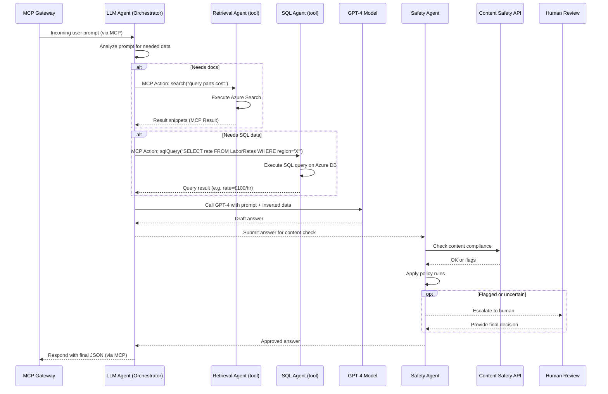

**Component Interaction Explanation:**

1. **MCP Gateway to LLM Agent:** The user's request arrives (possibly as an MCP conversation start) to the LLM Orchestrator agent via the gateway.
2. **LLM Agent analyzes the prompt:** It decides which tools to use. Suppose the user asks: *"How much will it cost to fix the bumper and headlight? My car is a 2018 Camry in Paris."* The LLM agent sees it might need part prices (maybe those are in docs) and labor rate (perhaps in SQL).
3. **If documents needed:** The LLM agent issues an **MCP Action** to the Search tool: e.g., `Action: Search.Tool with query "2018 Camry bumper price"`. The MCP Gateway routes this to **SearchAgent**. SearchAgent runs the query on Azure Search and returns results.
4. **If SQL data needed:** The LLM agent similarly issues an **Action** to the SQL tool: e.g., `Action: SQL.Tool with query "SELECT rate FROM LaborRates WHERE region='Paris'"`. The SQLAgent executes on Azure SQL DB and returns `rate=100` (euros/hour perhaps).
5. **LLM Agent receives results:** MCP ensures the agent gets the outputs from those tools, which the LLM agent then incorporates into its working context (chain-of-thought). The LLM (which is GPT-4 in this case) hasn't been called yet— the LLM agent might be internally a small policy that first gathers info.
6. **LLM Agent calls GPT-4 Model:** With the info gathered (like snippet "bumper part €400, headlight €250" and labor rate "€100/hr"), the agent crafts the final prompt and calls GPT-4 via Azure OpenAI. (This could be done through the model router if a choice of model is needed, but for simplicity we just show GPT-4.)
7. **Model returns draft answer:** e.g., *"It will cost about €800 total (parts €650 + 1.5 hours labor €150)."* in JSON format.
8. **Safety Agent check:** The LLM agent sends this to SafetyAgent (or SafetyAgent might intercept automatically via MCP policies). SafetyAgent calls Content Safety API and applies any compliance rules (e.g., no personal data leakage – not an issue here).
9. **If flagged:** (unlikely in this scenario, but if user input had some profanity or the model said something off, it would go here) – escalate to Human for review, who then approves or edits.
10. **SafetyAgent returns approved answer** to LLM agent.
11. **LLM Agent sends final answer via MCP** back through Gateway to the user.

Key takeaways:

* The LLM Orchestrator agent **dynamically uses two tools (Search, SQL)** during its reasoning. This shows no loss of function; in fact, we added an ability to query structured data directly.
* MCP orchestrates this in a standard way (the actions and results flow).
* The content safety and human review are still in place, now as a separate agent or process but integrated via the protocol or workflow.
* At the end, the **user receives the final JSON** like always.

One advantage: because this uses MCP (an open protocol), if we ever wanted to replace, say, the Azure SearchAgent with a third-party knowledge base, we could do that as long as it speaks MCP. The LLM agent's prompts don't need heavy refactoring – it just knows it has a "knowledge" tool. Similarly, the SQL tool could be swapped for another data API if needed. The **loose coupling** is a win for future changes.

## **Deployment / Infrastructure Diagram**

We depict how these MCP components deploy on Azure:

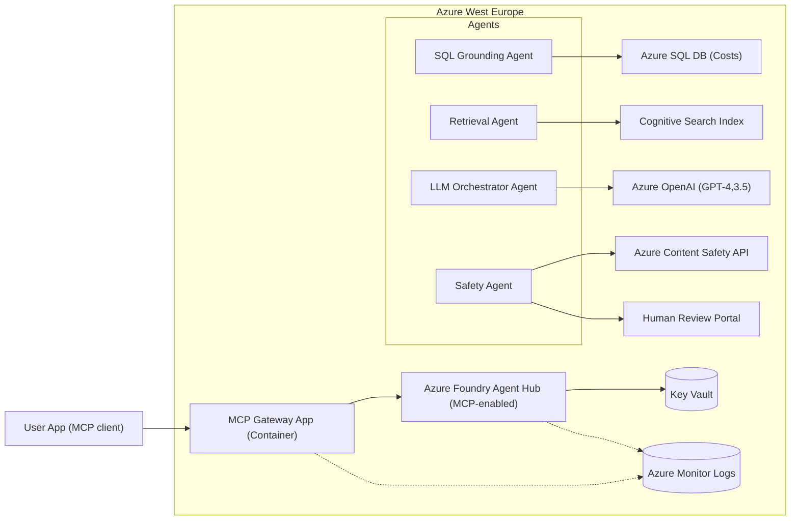

**Deployment Details:**

* **MCP Gateway App:** Could be an Azure Container Instance or small web service. The Azure Foundry blog shows running an MCP server via a Python script; we could containerize that and run it in Azure (e.g., Azure Container Apps in West Europe). It connects to the agent hub via the project connection string/IDs.
* **Azure Foundry Agent Hub:** Azure's Agent Service hosts our agents (SQLAgent, SearchAgent, LLMAgent, SafetyAgent) as part of a project. We denote them in a subgraph. The MCP Gateway communicates with them through the Foundry's API (secured via connection string).
* **Azure SQL Database:** Hosted in West Europe with the cost tables. SQLAgent has connection string from Key Vault to query it. Possibly a Private Link if the agent runs in a VNet.
* **Cognitive Search Index:** Same index as before, private endpoint accessible to SearchAgent.
* **Azure OpenAI Models:** GPT-4 and GPT-3.5 deployments used by the LLMAgent (via router or direct calls). The agent likely calls them via the Azure SDK internally.
* **Azure Content Safety API:** Called by SafetyAgent.
* **Key Vault:** Stores secrets (DB credentials, search keys, OpenAI keys, etc.).
* **Monitoring:** All interactions logs go to MonitorLogs. Because MCP requests are a bit more complex, we might ensure to log each tool invocation and result for traceability (Foundry likely does some of this).
* **Human Review Portal:** Same as prior approaches.

Everything is within Azure West Europe, ensuring data stays in region. The MCP Gateway and Agent Service could be integrated within a VNet or use service endpoints as needed.

This approach, albeit quite advanced, is **fully achievable on Azure** as of 2025 given Azure AI Foundry's MCP support. It does not sacrifice any capability—if anything, it adds more (SQL integration, easy expandability). The complexity is highest here: developers must be comfortable with the MCP paradigm and maintaining potentially multiple AI services. Observability is crucial, but Azure's evolving toolset is meant to handle it (Responsible AI dashboards, etc.). The payoff is an **AI architecture that can evolve with minimal refactoring**, making it somewhat "future-proof" and vendor-agnostic while still running on Azure.

## **Nominal Sequence Diagram (Key Scenario)**

Finally, let's illustrate a typical end-to-end flow in the MCP-based system for a claim query:

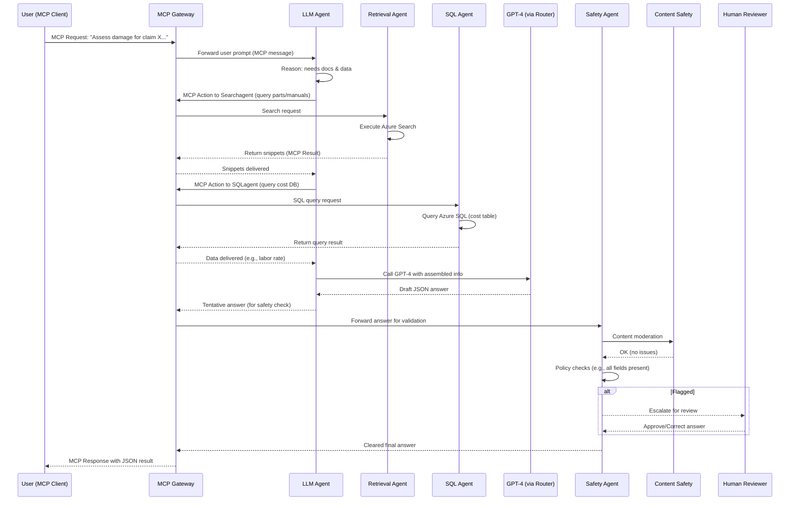

**Sequence Explanation:**

* The user sends an MCP-formatted request (which could be just a normal JSON if the client is abstracted, but effectively it's addressed to the Gateway).
* Gateway relays it to the **LLM Orchestrator agent**.
* The LLM agent decides to call the **Search agent** via an MCP action. The Gateway handles invoking the Search agent and returning results.
* The LLM agent then calls the **SQL agent** similarly and gets back structured data.
* With those, the LLM agent calls **GPT-4** (through the model router). GPT-4 returns a draft.
* The agent sends the draft to be checked by the **Safety agent** (the step "LLMagent-->>Gateway: Tentative answer" could be implicit; possibly the Gateway or Orchestrator ensures safety check before finalizing).
* Safety agent calls **Content Safety API** (which says it's fine).
* If all good, Safety returns the okayed answer. If not, human loop happens as shown.
* The Gateway then sends the final answer back to the user in the MCP response format.

Through this, all actions (Search, SQL, Safety) are mediated by the Gateway using MCP – which shows the standardized communication. The user gets the result which is identical in content to what they'd get in other approaches (a JSON assessment). But now our system is extremely flexible and "plug-and-play" for new tools/models.